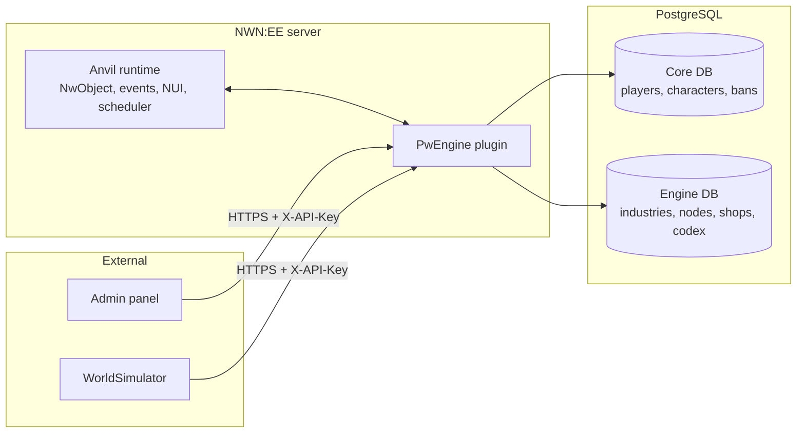
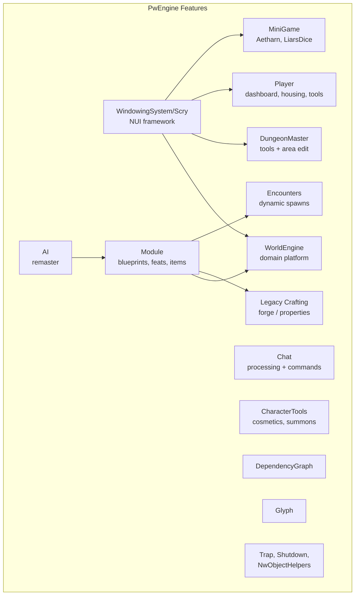
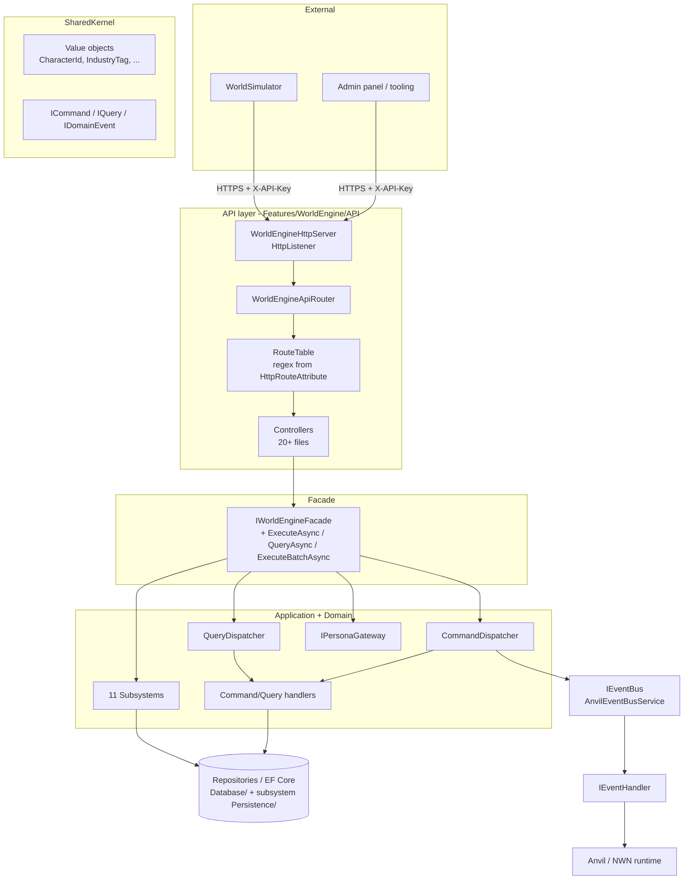
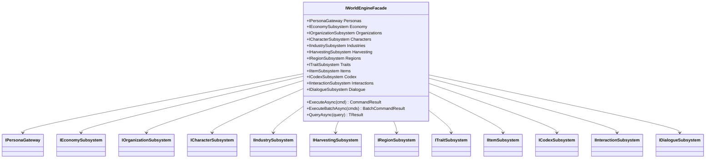
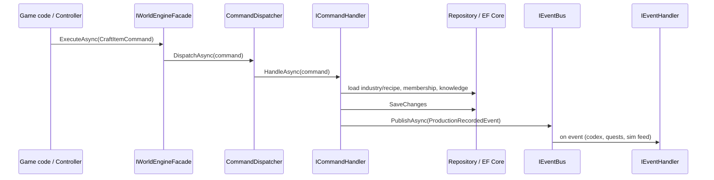
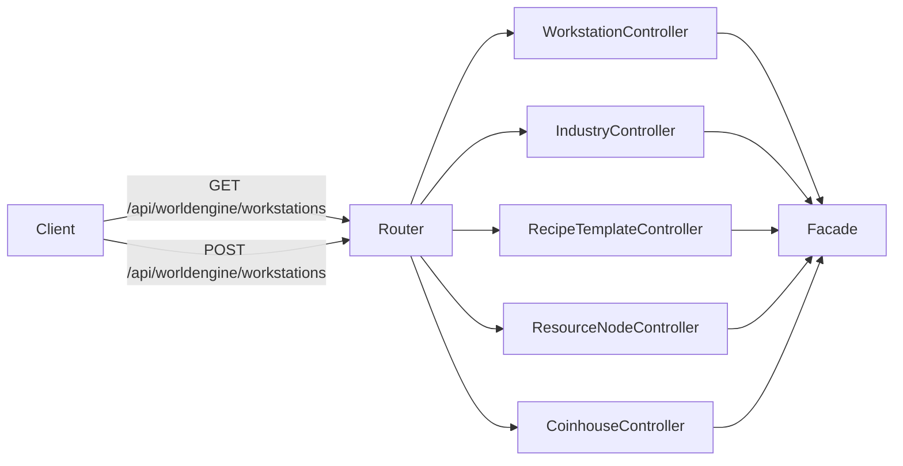
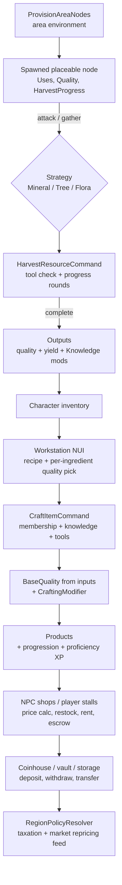

# PwEngine Architecture

`AmiaReforged.PwEngine` (`net8.0`, Anvil `8193.37.x`) is the gameplay-rule host for the Amia persistent world. It runs **in-process with the NWN:EE server** via Anvil DI (`[ServiceBinding]`) and is organized as **vertical feature slices** plus one large bounded context: **WorldEngine**. It references `AmiaReforged.Core` (legacy persistence) and `AmiaReforged.Races`, with its own EF Core store (`PwEngineContext`, Npgsql + SQL Server packages, InMemory + Testcontainers for tests).

Sources: `AmiaReforged.PwEngine.csproj`, `PwEngine-README.md`, `WorldEngine-architecture.md`, `WorldEngine-subsystems.md`, `WorldEngine-cqrs.md`, `WorldEngine-api-reference.md`.

## 1. Runtime context

Key facts:

- One `.csproj` is both **runtime and test project** (`IsTestProject=true`, NUnit + Moq + FluentAssertions). Tests live next to features (`Tests/`, `Subsystems/*/Tests/`).
- DI is Anvil's: `[ServiceBinding(typeof(X))]` registers implementations; consumers constructor-inject. No Startup.cs composition root — bootstrap services run at module load (e.g. `WorldEngineHttpApiBootstrap`, `EconomyBootstrapService`, `WorkstationBootstrapService`).
- Top-level code besides features: `Database/` (EF `PwEngineContext`, `PwContextFactory`, `EngineDbConfig`, per-aggregate repositories), `PersistentKnowledgeMapper.cs`, `PwLoginService.cs`, `Resources/WorldEngine/` (JSON: nodes, regions, item blueprints), `Webpages/` (`crafting.html`, `prayers.html`).

## 2. Feature map (vertical slices)

| Feature | Folder | Responsibility |
| --- | --- | --- |
| WorldEngine | `Features/WorldEngine/` | Facade + 11 subsystems + CQRS + HTTP API (see §3–§6). The future platform; largest slice. |
| AI | `Features/AI/` (`AI_REMASTER.md`, `AI_PHASE1/2_PROGRESS.md`) | `AiMasterService`, `AiBlindnessService`, `Behaviors/`, `Core/`, `LegacyScripts/`. Remaster in progress. |
| Chat | `Features/Chat/` | `ChatProcessingService`, `Commands/`. Chat pipeline + `./codex` style commands. |
| Legacy Crafting | `Features/Crafting/` | Pre-WorldEngine forge: `CasterWeaponForge`, `MythalForgeInitializer`, `CraftingBudgetService`, `DifficultyClassCalculator`, `PropertyValidator`, `ItemProperties/`, `Models/`, `Nui/`. Distinct from WorldEngine Industries. |
| Encounters | `Features/Encounters/` | `DynamicEncounterService`, `Services/`, `Models/`, `Migration/`, `API/`. Day/night + dynamic spawns. |
| DungeonMaster | `Features/DungeonMaster/` | `DungeonMasterToolsService`, `DmWindowFactory` + `IDmWindow` presenters (`DmToolPresenter/Model/View`), `AreaEdit`, `BanManager`, `CopyMachine`, `EncounterBuilder`, `GuardSpawner`, `ItemEditor`, `DreamcoinRentals`, `DreamcoinTool`, `DmDcPlaytimeService`. |
| Player | `Features/Player/` | `Dashboard/`, `Housing/`, `DreamcoinTool/`, `PlayerTools/` (incl. rename service — see `README_RENAME_SERVICE.md`). |
| Module | `Features/Module/` | Static game data: `BlueprintManager`, `AppearanceCache`, `FeatCache`, `CreatureData`, `ItemData`, `InventoryData`, `IBlueprint`, `DeveloperTools/`, `DivineClassFeatures/`. Shared by AI, Crafting, Encounters. |
| WindowingSystem / Scry | `Features/WindowingSystem/` | NUI framework used by WorldEngine + DM + minigames: `Scry/ScryPresenter/ScryView/WindowDirector`, `GenericWindows`, `IAutoCloseOnMove`, `ParchmentRepeater`, `NuiUtils`, `DevicePropertyService`. |
| MiniGame | `Features/MiniGame/` | `Aetharn/` (`AETHARN_DESIGN.md`), `LiarsDice/`. Self-contained games on Scry windows. |
| CharacterTools | `Features/CharacterTools/` | Cosmetics/RP: `BoxOfHats`, `HeightChanger`, `ThousandFaces`, `TemporaryNameChanger`, `MagicalQuiver`, `CustomSummon`, `VfxTools`. |
| DependencyGraph | `Features/DependencyGraph/` | `DependencyGraphBuilder` + DTOs; also exposed via `DependencyGraphController`. |
| Glyph | `Features/Glyph/` | `GlyphBootstrap`, `API/Core/Runtime/Persistence/Integration`. Rune/glyph subsystem. |
| Trap / Shutdown / NwObjectHelpers | `Features/Trap/`, `Features/Shutdown/` (`ResetService`), `Features/NwObjectHelpers/` (`ItemPropertyHelper`) | Small utilities. |

## 3. WorldEngine layering

Layer responsibilities:

- **API/** — `WorldEngineHttpServer` (validates `X-API-Key`, correlation IDs, camelCase JSON), `WorldEngineApiRouter` + `RouteTable` (assembly scan of `[HttpGet/Post/Put/Patch/Delete]`, most-specific first), `RouteContext` (route values, query params, `ReadJsonBodyAsync<T>`, `IServiceProvider`), `WorldEngineHttpApiBootstrap` (reads env, starts listener). Controllers are static-`Task<ApiResult>` where possible; stateful ones are `Activator`-created, so they resolve services via `ctx.Services`.
- **Facade** — `IWorldEngineFacade`/`WorldEngineFacade`: 1 gateway + 11 subsystem properties + centralized `ExecuteAsync/ExecuteBatchAsync/QueryAsync`. Thin aggregator; all constructor-injected.
- **Application/** — cross-subsystem commands/queries/handlers (`Industries/Commands/CraftItemCommand`, `Items/Handlers/*`, `Organizations/`, `Regions/`, `Traits/`).
- **Subsystems/** — one interface per boundary (`I*Subsystem.cs`), impl in `Subsystems/Implementations/` or the subsystem folder, repositories (never raw DbContext), bootstrap seeders.
- **SharedKernel/** — `ICommand/IQuery/IDomainEvent`, IDs (`CharacterId`, `DmId`, `OrganizationId`, `GovernmentId`), tags (`IndustryTag`, `WorkstationTag`, `TraitTag`), `CraftingQuality`, `WorldConstants`, `WorldEngineConfig`, `IWorldConfigProvider`, `DeterministicGuidFactory`.
- **Services/** — `AnvilEventBusService` (in-memory bus bridging dispatchers to Anvil thread via `NwTask.SwitchToMainThread`).
- **Sanitization/** — local-variable sanitization before persistence/NWN interop.
- **Core/Personas/** — `IPersonaGateway`/`PersonaGateway`: unifies players, characters, orgs, governments, NPCs under `PersonaId`.

## 4. Facade and subsystems

Subsystem internals (code → `Features/WorldEngine/Subsystems/<Name>/`, docs → `Docs/WorldEngine-*.md`):

| Subsystem | Key contents | Notes |
| --- | --- | --- |
| Economy | `EconomySubsystem`, `EconomyBootstrapService`, `Implementation/{Accounts,Banks,Shops,Storage,Properties,Transactions,Treasuries,Taxation,ValueObjects(GoldAmount,TransactionReason)}`, `Facades/{IBanking,IShop,IStorage}`, `UI/Banking/` | Umbrella over 3 facades. Shops: `NpcShop*`, `ShopPriceCalculator`, restock strategies, `PlayerStalls/` aggregate (claim/list/release, rent commands, reeve lockup, escrow). Storage: `Store/WithdrawItem`, capacity upgrades, foreclosure. Banks: coinhouse accounts, roles/permissions, shared-account docs. Properties: rent/pay/evict, occupancy, activity tracker. |
| Industries | `Industry`, `Recipe`, `RecipeTemplate` + `RecipeTemplateExpander`, `Workstation` + `WorkstationBootstrapService`, `IndustryMembershipService`, `ProficiencyProgressionService` (`ProficiencyLevel`, `ProficiencyXpCurve`), `KnowledgeSubsystem/` (`Knowledge`, `KnowledgeEffect`, `KnowledgeProgressionService`, caps), `Crafting/README` (design), `Nui/WorkstationCrafting*`, `CraftingProgress*`, `Persistence/Db*Repository` | Recipe templates match by material category + `ItemForm` and expand (e.g. one plank template → per-wood recipes). Workstations are global (own DB table), shared across industries. |
| Harvesting | `HarvestResourceCommand/Handler`, `Strategies/{Mineral,TreeFelling,FloraGather}`, `NodeHarvestStrategyRegistry`, `Nui/HarvestProgress*`, `HarvestContext/Output/Result/Step`, `ItemForm`, `SpawnedNode`, events (`ResourceHarvested`, `NodeDepleted`) | Gathering interactions; per-type strategies wired to placeable events. |
| ResourceNodes (supporting) | `ResourceNodeData/{ResourceNodeDefinition,ResourceNodeInstance,ResourceType}`, `Services/{AreaProvisioning,ResourceNodeInstanceSetup,ResourceNodeService,RuntimeNodeService,TriggerBasedSpawnService}`, `Persistence/DbResourceNodeDefinitionRepository` | Definitions are JSON (`Resources/WorldEngine/Nodes/`); instances spawned at module load with area-derived quality. |
| Codex | `Application/{CodexEventProcessor,CodexQueryService,DynamicQuestService,QuestObjectiveResolutionService}`, `Domain/{Aggregates,Entities,Enums,Events,Objectives,Repositories}`, NUI 6-tab window, `./codex` command | Best-documented: `WorldEngine-codex.md` Capability\|Status table. Journal + quests + lore + notes + reputation + traits + dynamic quests. |
| Characters | `CharacterRegistrationService`, `Runtime/{RuntimeCharacter,Repository,Service,SheetPort,InventoryPort}`, `CharacterData/{Statistics,Knowledge,Reputation,Skills}`, `CharacterIdentity/`, `Services/CharacterStatService` | Persistent registration + runtime sheet/inventory ports. |
| Organizations | impl + `Application/Organizations/` commands/queries | Guilds/factions, membership, ranks, diplomacy. Backs bank roles + civic sim. |
| Regions | impl + `Application/Regions/` | Area groupings + regional effects; consumes `AreaGraph` + environment (`MineralQualityRange`, `Climate`, `SoilQuality`). |
| Traits | impl + `Application/Traits/` | Character traits + effects; `TraitBootstrapService`. |
| Items | `ItemSubsystem`, `Application/Items/Handlers/*`, item definitions/blueprints/properties | Blueprint registry feeds recipe-template expansion + shop factories. |
| Interactions | `InteractionSubsystem` | Generic framework (harvest, prospect, …) that Harvesting strategies plug into. |
| Dialogue | `DialogueSubsystemImpl` | NPC trees + runtime conversations; feeds codex objective signals. |
| Supporting | `AreaGraph/{AreaGraphBuilder,CacheService}`, `AreaPersistence/{PlaceablePersistence,RenderDistance,TriggerAllowance}`, `Time/` | Connectivity graph, persistent placeables, calendar. |

Conventions (from `WorldEngine-subsystems.md`): one interface per boundary on the facade; subsystems talk to repositories, never each other (coordination via facade/events/Personas); bootstrap services hydrate runtime from persistence.

## 5. CQRS + events

- Commands mutate (`DepositGoldCommand`, `HarvestResourceCommand`, `CraftItemCommand`, `ProvisionAreaNodesCommand`, `RentPropertyCommand`, …); queries read (`GetBalanceQuery`, `GetStoredItemsQuery`, `GetAvailableRecipesQuery`, …); events announce (`ResourceHarvestedEvent`, `NodeDepletedEvent`, `ProductionRecordedEvent`, `ProficiencyGainedEvent`, `GoldDeposited/Withdrawn/Transferred`, stall events, …).
- Handlers are `[ServiceBinding(typeof(ICommandHandler<T>))]` (+ `ICommandHandlerMarker`); dispatchers resolve by command type via reflection. Batch execution supported.
- HTTP controllers translate routes → facade calls; game code (strategies, presenters, Anvil event handlers) calls the facade directly, switching to the main thread (`NwTask.SwitchToMainThread`) for NWN object access.

## 6. HTTP API surface

Controllers in `Features/WorldEngine/API/Controllers/` (+ `API/Tests/`): `Health`, `Echo`, `Industry`, `Workstation`, `RecipeTemplate`, `ResourceNode`, `Interaction`, `Item`, `Coinhouse`, `Organization`, `Quest`, `Lore`, `Dialogue`, `Region`, `Trait`, `AreaGraph`, `AreaReload`, `DependencyGraph`, `ExampleBanking`. Full route list: `WorldEngine-api-reference.md`; usage: `WorldEngine-example-calling-the-api.md`.

## 7. Economy loop (harvest → craft → sell → store/bank)

Details:

- **Nodes:** `ResourceNodeDefinition(Tag, Type, PlcAppearance, Requirement{Tool, Material}, Outputs[{tag, qty, chance}], Uses, BaseHarvestRounds, Min/MaxQuality)`; ore/geode quality rolls `MineralQualityRange`, flora adjusts for `Climate`/`SoilQuality`, all clamped per-node (`Industries-Crafting-README.md`, node JSON).
- **Harvest:** `HarvestResourceCommandHandler` caches the active session, requires the tool in `RightHand`, advances `HarvestProgress` by `1 + Knowledge[HarvestStepRate]`, returns `InProgress` until `BaseHarvestRounds`, then rolls `Chance`, applies `Knowledge[Quality/ItemYield]` (Additive/PercentMult), emits `ResourceHarvestedEvent`, decrements `Uses`, emits `NodeDepletedEvent` at 0. `MineralHarvestStrategy` hooks `OnPhysicalAttacked` + progress-bar NUI (`HarvestProgressPresenter/View`, auto-close on move/inactivity).
- **Craft:** `CraftItemHandler` checks membership → required knowledge → aggregates `CraftingModifier`s → `CraftingQuality.ComputeBaseQuality(InputQualities)` → `ICraftingProcessor` (default: `outputQuality = Clamp(base + QualityBonus)`, qty × multiplier, success-chance bonus) → awards knowledge progression + proficiency XP. Templates expand by category/form; workstations gate location; NUI is `WorkstationCrafting{Model,View,Presenter}` (search, pagination, quality picker). The **timed process-graph minigame** (`CraftingProgress`, `ProcessGraph`, action windows) is **designed but unchecked** (Phases 1–6 `[ ]` in `Industries-Crafting-README.md`); current flow is instant.
- **Sell/store:** NPC shops (`ShopPriceCalculator`, markups, blacklist, restock service) and player stalls (claim/list/release, rent + escrow + reeve lockup, member roles) move goods to gold; gold lands in coinhouse accounts/vaults/personal storage (`Store/WithdrawItem`, capacity upgrades, foreclosure path). `RegionPolicyResolver` + transaction history feed taxation and the WorldSimulator repricing loop.

## 8. Other flows

- **Codex/quest:** dialogue + harvest/production events → `CodexEventProcessor` → quest sessions (7 objective evaluators, All/Any/Sequence groups) → stage rewards (XP/gold/KP/proficiency) → 6-tab NUI + `./codex` + AdminPanel CRUD.
- **DM/Player ops:** DM windows (Scry presenters, auto-close on move) for bans, spawns, encounters, item edit, dreamcoin; player dashboard/housing/tools; shutdown `ResetService`.
- **AI/Encounters:** `AiMasterService` drives behaviors over `Module` blueprints/caches; `DynamicEncounterService` spawns from day/night + difficulty inputs.

## 9. Persistence and configuration

- `Database/PwEngineContext.cs` + `EntityConfig/` + `Entities/`: engine tables (industries, recipes, workstations, nodes, shops, coinhouse, properties, codex/quests). `PwContextFactory` + `EngineDbConfig` build the connection (env-driven, separate from Core DB). Per-aggregate `Persistent*Repository` classes; subsystems depend on repository interfaces, with `InMemory*` fakes for tests.
- `Resources/WorldEngine/` JSON is content (nodes/regions/blueprints) loaded at bootstrap; `Migrations/` holds EF history.
- Cross-cutting: NLog logging, `IWorldConfigProvider`/`WorldEngineConfig`/`ProgressionCurveConfig`, local-variable sanitization, `DeterministicGuidFactory`, `QualityLabel`/`CraftingQuality` shared math.

## 10. What lives where (cheat sheet)

| Want… | Go to |
| --- | --- |
| Subsystem catalogue | `Docs/WorldEngine-subsystems.md`, `Docs/WorldEngine-docs-README.md` |
| Layer diagram + API plumbing | `Docs/WorldEngine-architecture.md` |
| Command/query patterns | `Docs/WorldEngine-cqrs.md`, `Docs/WorldEngine-example-adding-a-command.md`, `…-adding-a-query.md`, `…-adding-a-subsystem.md` |
| HTTP routes | `Docs/WorldEngine-api-reference.md`, `Docs/WorldEngine-example-calling-the-api.md` |
| Crafting design + roadmap | `Docs/Industries-Crafting-README.md` |
| Codex status (Capability\|Status) | `Docs/WorldEngine-codex.md` |
| Stall rent tests | `Docs/PlayerStalls-RENT_COMMAND_TESTS_COMPLETE.md` |
| AI / Aetharn / rename / personas | `Docs/AI_REMASTER.md`, `Docs/AETHARN_DESIGN.md`, `Docs/README_RENAME_SERVICE.md`, `Docs/Personas-README.md` |
| Portal index | `Docs/README.md` |
