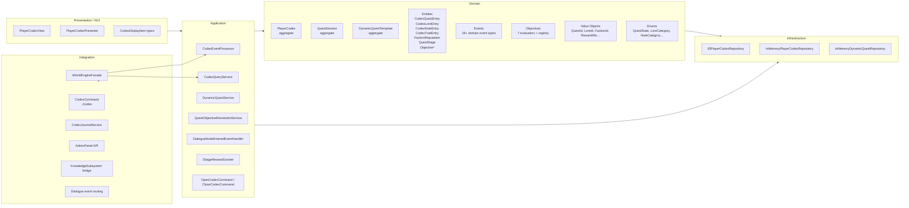

# Codex Subsystem

## 1. Overview

The Codex is a **player-facing in-game journal, quest tracker, lore compendium, and reputation/economy viewer** for the Amia Reforged server. It replaces and extends the standard NWN journal with persistent, server-authoritative content.

**Status: Substantially implemented — active development continues.**

### Key capabilities

| Capability | Status |
|---|---|
| NUI window with 6-tab interface (Knowledge, Quests, Notes, Reputation, Traits, Economy) | Complete |
| Lore/knowledge entry CRUD with category browsing and search | Complete |
| Per-character lore unlock tracking with always-available fallback | Complete |
| Quest stage management with auto-creation from definitions | Complete |
| Objective tracking with 7 evaluator types (kill, collect, reach location, escort, dialog choice, investigate, composite) | Complete |
| Quest stage rewards (XP, gold, KP, proficiency XP) | Complete |
| Player/DM notes with category and privacy flags | Complete |
| Faction reputation tracking (in-memory — table not yet created) | Active |
| Dynamic (procedural) quest lifecycle: posting, claiming, sharing, expiry | Complete |
| Event-sourced aggregate mutation via channel-based processor | Complete (with known TODOs) |
| EF Core persistence (PostgreSQL) for notes, lore, quests | Complete |
| Chat command (`./codex`) with journal integration toggle | Complete |
| AdminPanel HTTP API for lore and quest definition CRUD | Complete |
| Dialogue system integration for objective signals | Complete |
| Knowledge subsystem bridge (industry learning → codex lore unlock) | Complete |

### Source

The Codex subsystem lives at `AmiaReforged.PwEngine/Features/WorldEngine/Subsystems/Codex/` (≈82 source files).

---

## 2. Architecture

The Codex follows a **Domain-Driven Design** layered architecture:



### Layer breakdown

| Layer | Files | Responsibility |
|---|---|---|
| **NUI** | 4 | Window layout, tab switching, entry display, pagination |
| **Application** | 10 | Event processing, queries, objective resolution, dynamic quests, rewards, window commands |
| **Domain** | 35+ | Aggregates, entities, value objects, enums, events, objectives/evaluators, repository interfaces |
| **Infrastructure** | 3 | EF Core persistence, in-memory test doubles |
| **Interface** | 1 | `ICodexSubsystem` contract |
| **Implementation** | 1 | `CodexSubsystem` wiring layer |
| **Command/Journal** | 2 | Chat command handler, journal hook |

### Folder structure

```
Subsystems/Codex/
├── CodexCommand.cs                  # ./codex chat command
├── CodexJournalService.cs           # NWN journal open/close hooks
├── Application/
│   ├── CodexEventProcessor.cs       # Channel-based event processing
│   ├── CodexQueryService.cs         # Read-model queries & statistics
│   ├── QuestObjectiveResolutionService.cs  # NWN runtime → objective signals
│   ├── DynamicQuestService.cs       # Procedural quest lifecycle
│   ├── DialogueNodeEnteredEventHandler.cs  # Dialogue → quest signal bridge
│   ├── IStageRewardGranter.cs       # Reward translation interface
│   ├── NwnStageRewardGranter.cs     # Real reward granter (XP, gold, KP, prof)
│   └── Commands/
│       ├── OpenCodexCommand.cs
│       ├── CloseCodexCommand.cs
│       └── CodexWindowHandlers.cs
├── Domain/
│   ├── Aggregates/
│   │   ├── PlayerCodex.cs           # Main aggregate root
│   │   ├── QuestSession.cs          # Runtime objective state machine
│   │   └── DynamicQuestTemplate.cs  # Procedural quest template
│   ├── Entities/
│   │   ├── CodexQuestEntry.cs       # Quest within a player's codex
│   │   ├── CodexLoreEntry.cs        # Lore/knowledge entry
│   │   ├── CodexNoteEntry.cs        # Player/DM note
│   │   ├── CodexTraitEntry.cs       # Character trait
│   │   ├── FactionReputation.cs     # Faction reputation with history
│   │   ├── QuestStage.cs            # Stage definition (objectives, hints, rewards)
│   │   ├── QuestObjectiveGroup.cs   # Objective group with completion mode
│   │   ├── ObjectiveDefinition.cs   # Single objective definition
│   │   ├── ObjectiveState.cs        # Runtime objective state
│   │   └── DynamicQuestPosting.cs   # Active posting from a template
│   ├── Enums/
│   │   ├── QuestState.cs            # Discovered, InProgress, Completed, etc.
│   │   ├── LoreCategory.cs          # Arcana, History, Religion, Geography, etc.
│   │   ├── LoreTier.cs              # Common, Uncommon, Rare, Legendary
│   │   ├── NoteCategory.cs          # General, Quest, Character, Location, DM
│   │   ├── ExpiryBehavior.cs        # Fail, Remove, Cooldown
│   │   ├── DynamicQuestSource.cs    # BountyBoard, NpcQuestGiver, WorldEvent, Custom
│   │   ├── CompletionMode.cs        # All, Any, Sequence
│   │   ├── ClaimMode.cs             # Unlimited, Limited, Exclusive
│   │   └── TraitCategoryExtensions.cs
│   ├── Events/
│   │   ├── CodexDomainEvent.cs      # Abstract base record
│   │   ├── QuestEvents.cs           # 6 quest event types
│   │   ├── LoreEvents.cs            # LoreDiscovered
│   │   ├── NoteEvents.cs            # NoteAdded, NoteEdited, NoteDeleted
│   │   ├── ReputationEvents.cs      # ReputationChanged
│   │   ├── TraitEvents.cs           # TraitAcquired
│   │   ├── ObjectiveEvents.cs       # 4 objective event types
│   │   └── DynamicQuestEvents.cs    # 6 dynamic quest event types
│   ├── Repositories/
│   │   ├── IPlayerCodexRepository.cs
│   │   └── IDynamicQuestRepository.cs
│   ├── Objectives/
│   │   ├── QuestSessionManager.cs   # Active session registry per character
│   │   ├── QuestSignal.cs           # Signal value object
│   │   ├── SignalType.cs            # Signal type constants
│   │   ├── EvaluationResult.cs      # Evaluator result record
│   │   ├── IObjectiveEvaluator.cs   # Evaluator interface
│   │   ├── IObjectiveEvaluatorRegistry.cs
│   │   ├── ObjectiveEvaluatorRegistry.cs
│   │   ├── Models/
│   │   │   ├── StateMachineDefinition.cs
│   │   │   └── ClueGraph.cs
│   │   └── Evaluators/
│   │       ├── KillObjectiveEvaluator.cs
│   │       ├── CollectObjectiveEvaluator.cs
│   │       ├── ReachLocationObjectiveEvaluator.cs
│   │       ├── EscortObjectiveEvaluator.cs
│   │       ├── DialogChoiceObjectiveEvaluator.cs
│   │       ├── InvestigateObjectiveEvaluator.cs
│   │       └── CompositeObjectiveEvaluator.cs
│   └── ValueObjects/
│       ├── QuestId.cs, LoreId.cs, FactionId.cs
│       ├── PostingId.cs, TemplateId.cs
│       ├── ObjectiveId.cs + JsonConverter
│       ├── ReputationScore.cs, RewardMix.cs
│       ├── Keyword.cs, ClaimSlot.cs
├── Infrastructure/
│   ├── EfPlayerCodexRepository.cs
│   ├── InMemoryPlayerCodexRepository.cs
│   └── InMemoryDynamicQuestRepository.cs
└── Nui/
    └── Player/
        ├── PlayerCodexView.cs       # NUI layout (820×620, three-panel)
        ├── PlayerCodexPresenter.cs   # Tab switch, filtering, pagination
        ├── CodexTab.cs              # 6-tab enum
        └── CodexDisplayItem.cs      # 6 display item types
```

---

## 3. Domain Model

### Aggregate roots

| Aggregate | File | Responsibility |
|---|---|---|
| `PlayerCodex` | `Domain/Aggregates/PlayerCodex.cs` | Root aggregate for one character's entire codex: quests, lore, notes, reputations, traits. Supports both players and DMs. |
| `QuestSession` | `Domain/Aggregates/QuestSession.cs` | Runtime state machine for a character's active quest. Tracks objective progress, evaluates signals, handles stage advancement. |
| `DynamicQuestTemplate` | `Domain/Aggregates/DynamicQuestTemplate.cs` | Template for procedurally generated quests with configurable parameters, reward tables, and expiry rules. |

### Entities

| Entity | Purpose |
|---|---|
| `CodexQuestEntry` | Per-character quest progress: state, current stage, stage data, deadlines, completion count |
| `CodexLoreEntry` | Lore/knowledge entry: title, content, category, tier, tags, source reference |
| `CodexNoteEntry` | Player/DM note: content, category, privacy flags (DM-only, private) |
| `CodexTraitEntry` | Character trait record sourced from the trait subsystem |
| `FactionReputation` | Faction reputation score with change history |
| `QuestStage` | Stage definition: journal text, objectives, completion hints, reward mix |
| `QuestObjectiveGroup` | Group of objectives with completion mode (All, Any, Sequence) |
| `ObjectiveDefinition` | Single objective: type, target reference, required count, signal filter |
| `ObjectiveState` | Runtime objective progress: current count, completion status |
| `DynamicQuestPosting` | Active quest posting created from a template: claim info, deadline, status |

### Value objects

| Value Object | Purpose |
|---|---|
| `QuestId`, `LoreId`, `FactionId` | Strongly-typed IDs backed by strings |
| `PostingId`, `TemplateId` | Strongly-typed IDs for dynamic quests |
| `ObjectiveId` | Strongly-typed objective ID with JSON converter |
| `ReputationScore` | Faction reputation with min/max bounds |
| `RewardMix` | Reward bundle: XP, gold, knowledge points, proficiency XP |
| `Keyword` | Tag/search keyword (value equality) |
| `ClaimSlot` | Slot assignment for dynamic quest claims |

### Enums

| Enum | Values |
|---|---|
| `QuestState` | Discovered, InProgress, Completed, Failed, Abandoned, Expired |
| `KnowledgeCategory` | History, Geography, Magic, Religion, Nature, Culture, Organizations, Creatures, Items, Persons, Events, Legends, Secrets |
| `LoreCategory` | Arcana, ArchitectureAndEngineering, Dungeoneering, Geography, History, Local, Nature, NobilityAndRoyalty, Religion, ThePlanes, Ooc |
| `LoreTier` | Common, Uncommon, Rare, Legendary |
| `NoteCategory` | General, Quest, Character, Location, DmNote, DmPrivate |
| `ExpiryBehavior` | Fail, Remove, Cooldown |
| `DynamicQuestSource` | BountyBoard, NpcQuestGiver, WorldEvent, Custom |
| `CompletionMode` | All, Any, Sequence |
| `ClaimMode` | Unlimited, Limited, Exclusive |
| `CodexTab` | Knowledge, Quests, Notes, Reputation, Traits, Economy |

---

## 4. Application Layer

### CodexEventProcessor

`Application/CodexEventProcessor.cs` — Processes domain events from a `Channel<CodexDomainEvent>` and applies them to `PlayerCodex` aggregates via `IPlayerCodexRepository`. Registered as `[ServiceBinding(typeof(CodexEventProcessor))]`.

- **Event types handled**: QuestDiscovered, QuestStarted, QuestCompleted, QuestFailed, QuestAbandoned, QuestStageAdvanced, StageRewardsGranted, LoreDiscovered, NoteAdded, NoteEdited, NoteDeleted, ReputationChanged, TraitAcquired, QuestPosted, QuestClaimed, QuestShared, QuestExpired, QuestUnclaimed
- **Known TODO**: `ProcessEventsAsync` currently reads events one-by-one; needs sequential per-character processing via `GroupBy` or similar.
- **Known TODO**: `ApplyEventAsync` has no-op placeholders for `ObjectiveProgressedEvent`, `ObjectiveCompletedEvent`, `ObjectiveFailedEvent`, `QuestObjectiveGroupCompletedEvent` — runtime state is managed by `QuestSession` instead.

### CodexQueryService

`Application/CodexQueryService.cs` — Read-only query service providing DTO projections and statistics from `PlayerCodex` aggregates. Methods return filtered/sorted views of quests, lore, notes, reputations, traits, plus aggregate statistics.

### QuestObjectiveResolutionService

`Application/QuestObjectiveResolutionService.cs` — Bridges NWN runtime events (creature death, item acquire/lose, area entry/exit) to `QuestSignal` objects and routes them to active `QuestSession` instances. Subscribes to `RuntimeCharacterService` for login/logout lifecycle.

### DynamicQuestService

`Application/DynamicQuestService.cs` — Lifecycle for procedurally generated quests: posting, claiming, sharing, expiry, and unclaiming. Interfaces with `IDynamicQuestRepository`.

### DialogueNodeEnteredEventHandler

`Application/DialogueNodeEnteredEventHandler.cs` — Listens for `DialogueNodeEnteredEvent` from the dialogue subsystem and routes dialog choices as `QuestSignal` objects to the objective resolution service.

### Stage reward granting

| Type | File | Purpose |
|---|---|---|
| `IStageRewardGranter` | `Application/IStageRewardGranter.cs` | Interface: translates `RewardMix` into character rewards |
| `NwnStageRewardGranter` | `Application/NwnStageRewardGranter.cs` | Real implementation: grants XP, gold, knowledge points, and proficiency XP. Uses `Lazy<T>` to resolve circular DI chain with industry services. |

### Window commands

| Command | Handler | Purpose |
|---|---|---|
| `OpenCodexCommand` | `OpenCodexHandler` | Opens the NUI window for a player (enforces one-window-per-player) |
| `CloseCodexCommand` | `CloseCodexHandler` | Closes the NUI window |

---

## 5. User Interface

### Window layout

`Nui/Player/PlayerCodexView.cs` — 820×620 NUI window with a three-panel design:

```
┌─────────────────────────────────────────────────────┐
│ [Knowledge] [Quests] [Notes] [Reputation] [Traits] [Economy] │  ← Tab bar
├────────┬──────────────────────┬──────────────────────┤
│        │                      │                      │
│  Cat.  │     Entry List       │    Detail Pane       │
│ Sidebar│   (paginated, 8/page)│   (scrollable)       │
│        │                      │                      │
│        │  [<]  Page 1/3  [>]  │                      │
│        │                      │                      │
├────────┴──────────────────────┴──────────────────────┤
│                              [Close]                 │  ← Bottom bar
└─────────────────────────────────────────────────────┘
```

- Category sidebar (130px) — swapped via `SetGroupLayout` per tab
- Entry list (270px) — 8 rows with name, subtitle, ">" detail button
- Detail pane (350px) — title + body text
- Economy tab — replaces entry list with proficiency level + progress bar + paginated knowledge entries

### Tab system

`Nui/Player/CodexTab.cs` — 6 tabs: Knowledge, Quests, Notes, Reputation, Traits, Economy

`Nui/Player/PlayerCodexPresenter.cs` — Handles tab switching, category filtering, entry selection, pagination, and Economy tab proficiency display.

### Display items

`Nui/Player/CodexDisplayItem.cs` — Implements `ICodexDisplayItem` for 6 entry types: Lore, Quest, Note, Reputation, Trait, Knowledge.

### Window lifecycle

- Opened via `./codex` chat command (`CodexCommand.cs`)
- Auto-opens when journal is opened (if player has `ds_pckey` and hasn't opted out with `./codex no-journal`)
- One-window-per-player enforced
- Controlled via `WindowDirector` from the WindowingSystem/Scry framework

---

## 6. Persistence

### Entity → table mapping

| Entity | Table | Purpose |
|---|---|---|
| `PersistedCodexNote` | `codex_notes` | Player/DM notes with content, category, privacy flags |
| `PersistedCodexQuest` | `codex_quests` | Per-character quest progress with stage JSON, deadlines, completion count |
| `PersistedQuestDefinition` | `codex_quest_definitions` | Global quest definitions with stage JSON |
| `PersistedLoreDefinition` | `codex_lore_definitions` | Global lore definitions (shared content, always-available flag) |
| `PersistedLoreUnlock` | `codex_lore_unlocks` | Per-character lore unlock records with discovery metadata |

### EF Core configurations

| Configuration | File |
|---|---|
| `PersistedCodexNoteConfiguration` | `Database/EntityConfig/PersistedCodexNoteConfiguration.cs` |
| `PersistedCodexQuestConfiguration` | `Database/EntityConfig/PersistedCodexQuestConfiguration.cs` |
| `PersistedLoreDefinitionConfiguration` | `Database/EntityConfig/PersistedLoreDefinitionConfiguration.cs` |
| `PersistedLoreUnlockConfiguration` | `Database/EntityConfig/PersistedLoreUnlockConfiguration.cs` |
| `PersistedQuestDefinitionConfiguration` | `Database/EntityConfig/PersistedQuestDefinitionConfiguration.cs` |

### Migration history

~30+ EF Core migrations span from March 2025 to April 2026. Key milestones:

| Migration | Date | Change |
|---|---|---|
| `AddCodexColumn` | 2025-03-05 | Initial codex column on character table |
| `AddQuestEntities` | 2025-03-22 | `CodexQuestDefinitions` table |
| `AddQuestCompletionTracking` | 2025-03-23 | Quest completion tracking fields |
| `AddQuestPersistence` | 2025-04-01 | `codex_quests` table |

All migrations: `AmiaReforged.PwEngine/Migrations/`

### Known gaps

- **Reputation data is in-memory only** until a dedicated `codex_reputation` table is created (noted in `EfPlayerCodexRepository.cs`)

---

## 7. Integration Points

### Facade

- `ICodexSubsystem` is exposed as `IWorldEngineFacade.Codex` (defined in `IWorldEngineFacade.cs`, wired in `WorldEngineFacade.cs`)
- Any component with access to the facade can call codex operations

### Chat command

- `CodexCommand.cs` — `./codex` opens the Codex (players only)
- Supports `./codex no-journal` and `./codex journal` toggles
- Registered as `[ServiceBinding(typeof(IChatCommand))]`

### Journal integration

- `CodexJournalService.cs` — hooks NWNX journal open/close events
- Auto-opens Codex when journal is opened (if player has `ds_pckey` and hasn't opted out)
- Adds "The Codex" custom journal entry on player login

### Knowledge subsystem bridge

- `KnowledgeEffect.cs` (in `Subsystems/Industries/KnowledgeSubsystem/`) defines `GrantCodexEntry` effect type
- Learning knowledge can trigger a `GrantCodexEntry` effect, pointing to a lore definition tag

### Dialogue system

- `DialogueNodeEnteredEventHandler.cs` routes `DialogueNodeEnteredEvent` → `QuestObjectiveResolutionService`
- Dialogue choices can complete "speak to NPC" objectives

### Runtime character service

- `QuestObjectiveResolutionService` subscribes to `RuntimeCharacterService.CharacterReady` and `CharacterLeaving` events
- Initializes/tears down quest sessions on login/logout
- Listens to item acquire/lose events for collect/kill objectives

### Trait subsystem

- `CodexEventProcessor` optionally depends on `ITraitSubsystem` to resolve trait metadata when a `TraitAcquiredEvent` is processed

### AdminPanel

- `WorldEngineEntityType.Codex` — indicates Codex is editable in the admin panel
- `LoreApiService.cs` — HTTP client for `/api/worldengine/codex/lore`
- `QuestApiService.cs` — HTTP client for `/api/worldengine/codex/quests`
- DTOs: `LoreDefinitionDto`, `QuestStageDto`, etc. in `WorldEngineDtos.cs`

### Industry/economy

- Economy tab in NUI shows proficiency levels and industry memberships
- `NwnStageRewardGranter` grants proficiency XP through `IIndustryMembershipService` and `IProficiencyProgressionService`

---

## 8. Objective Tracking

### Signal types

Signals decouple NWN game events from quest objective evaluation. Defined in `Domain/Objectives/SignalType.cs`:

| Signal | Meaning |
|---|---|
| `creature_killed` | A creature was killed by the character |
| `item_acquired` | An item was picked up |
| `item_lost` | An item was lost/dropped |
| `area_entered` | Character entered an area |
| `area_exited` | Character exited an area |
| `dialog_choice` | A dialogue node was selected |
| `clue_found` | An investigation clue was discovered |
| `npc_status_changed` | An NPC's state changed |
| `waypoint_reached` | Character reached a waypoint |
| `custom` | Generic custom signal |
| `timer_tick` | Periodic tick for deadline expiration |

### Evaluator catalog

All evaluators implement `IObjectiveEvaluator` and are registered in `ObjectiveEvaluatorRegistry`:

| Evaluator | File | Evaluates |
|---|---|---|
| `KillObjectiveEvaluator` | `Domain/Objectives/Evaluators/KillObjectiveEvaluator.cs` | Creature kills by tag/group |
| `CollectObjectiveEvaluator` | `Domain/Objectives/Evaluators/CollectObjectiveEvaluator.cs` | Item acquisition by tag/group |
| `ReachLocationObjectiveEvaluator` | `Domain/Objectives/Evaluators/ReachLocationObjectiveEvaluator.cs` | Area/waypoint entry |
| `EscortObjectiveEvaluator` | `Domain/Objectives/Evaluators/EscortObjectiveEvaluator.cs` | NPC status changes during escort |
| `DialogChoiceObjectiveEvaluator` | `Domain/Objectives/Evaluators/DialogChoiceObjectiveEvaluator.cs` | Specific dialogue node selections |
| `InvestigateObjectiveEvaluator` | `Domain/Objectives/Evaluators/InvestigateObjectiveEvaluator.cs` | Clue discovery + state machine progression |
| `CompositeObjectiveEvaluator` | `Domain/Objectives/Evaluators/CompositeObjectiveEvaluator.cs` | Delegates to sub-evaluators with logical combination |

### Objective evaluation pipeline

```
NWN Game Event (creature death, item acquire, area entry, dialog choice ...)
    │
    ▼
QuestObjectiveResolutionService ─── translates to QuestSignal
    │
    ▼
QuestSessionManager ─── routes to character's active QuestSession
    │
    ▼
QuestSession ─── evaluates against current stage's ObjectiveGroups
    │
    ▼
ObjectiveEvaluatorRegistry ─── dispatches to matching IObjectiveEvaluator
    │
    ▼
EvaluationResult (Completed / InProgress / Failed)
    │
    ▼
QuestSession.EvaluateProgress() ─── checks group completion mode (All/Any/Sequence)
    │
    ▼
Stage completion → QuestStageAdvanced event → reward granting
```

---

## 9. Test Coverage

The codex has **30 test files** with comprehensive coverage across all layers.

### Unit tests per area

| Test file | Scope | Lines |
|---|---|---|
| `PlayerCodexTests.cs` | Aggregate root: construction, quest/lore/note/reputation/trait commands & queries | 1,295 |
| `CodexEventProcessorTests.cs` | Event processing for all event types, edge cases, persistence | 913 |
| `CodexQueryServiceTests.cs` | All query methods, filtering, statistics | 515 |
| `CodexLoreEntryTests.cs` | Lore entry construction, search, category matching | 602 |
| `QuestSessionTests.cs` | Signal routing, objective progression, group completion, stage advancement | 325 |
| `KillObjectiveTests.cs` | Kill evaluator | |
| `CollectObjectiveTests.cs` | Collect evaluator | |
| `DialogChoiceObjectiveTests.cs` | Dialog choice evaluator | |
| `EscortObjectiveTests.cs` | Escort evaluator | |
| `CompositeObjectiveTests.cs` | Composite evaluator | |
| `InvestigateStateMachineTests.cs` | Investigate state machine | |
| `InvestigateClueGraphTests.cs` | Investigate clue graph | |
| `ObjectiveGroupTests.cs` | Group completion modes | |
| `QuestSessionStageAdvancementTests.cs` | Stage advancement logic | |
| `DialogueSignalRoutingTests.cs` | Dialogue → objective signal routing | |
| `QuestObjectiveResolutionServiceTests.cs` | End-to-end objective resolution | |
| `CodexSubsystemRewardTests.cs` | Stage reward granting | 170 |
| `CodexQuestEntryTests.cs` | Quest entry entity | |
| `CodexNoteEntryTests.cs` | Note entry entity | |
| `CodexTraitEntryTests.cs` | Trait entry entity | |
| `FactionReputationTests.cs` | Faction reputation entity | |
| `QuestDisplayItemTests.cs` | NUI display item rendering | |
| `RewardMixAndStageTests.cs` | Reward mixing and stage integration | |
| `KeywordTests.cs` | Keyword value object | |
| `LoreIdTests.cs`, `QuestIdTests.cs`, `FactionIdTests.cs` | Strongly-typed ID tests | |
| `ReputationScoreTests.cs` | Reputation score value object | |

All tests: `Features/WorldEngine/SharedKernel/Tests/Codex/`

### Known gap

- `CodexPageTests.cs` is an empty stub (has `SetUp` but no test methods)
- Objective event handling in `CodexEventProcessor.ApplyEventAsync` has no-op handlers (by design — runtime state lives in `QuestSession`)

---

## 10. Known Gaps & TODOs

| Area | Issue | Location |
|---|---|---|
| **Event processing** | `ProcessEventsAsync` processes events one-by-one; needs sequential per-character processing via `GroupBy` or similar | `CodexEventProcessor.cs` |
| **Objective event stubs** | `ObjectiveProgressedEvent`, `ObjectiveCompletedEvent`, `ObjectiveFailedEvent`, `QuestObjectiveGroupCompletedEvent` are received but intentionally no-op in `ApplyEventAsync` | `CodexEventProcessor.cs` |
| **Reputation persistence** | "Reputation data remains in-memory until its own table is created" | `EfPlayerCodexRepository.cs` (line 21) |
| **Empty test file** | `CodexPageTests` has no tests | `SharedKernel/Tests/Codex/CodexPageTests.cs` |

---

## 11. Quick Reference

### Key interfaces

| Interface | File | Implementations |
|---|---|---|
| `ICodexSubsystem` | `Subsystems/ICodexSubsystem.cs` | `CodexSubsystem` |
| `IPlayerCodexRepository` | `Domain/Repositories/IPlayerCodexRepository.cs` | `EfPlayerCodexRepository`, `InMemoryPlayerCodexRepository` |
| `IDynamicQuestRepository` | `Domain/Repositories/IDynamicQuestRepository.cs` | `InMemoryDynamicQuestRepository` |
| `ICodexDisplayItem` | `Nui/Player/CodexDisplayItem.cs` | 6 display item types |
| `IStageRewardGranter` | `Application/IStageRewardGranter.cs` | `NwnStageRewardGranter` |
| `IObjectiveEvaluator` | `Domain/Objectives/IObjectiveEvaluator.cs` | 7 evaluator implementations |
| `IObjectiveEvaluatorRegistry` | `Domain/Objectives/IObjectiveEvaluatorRegistry.cs` | `ObjectiveEvaluatorRegistry` |

### DI registration

All services are registered via Anvil's `[ServiceBinding(typeof(TInterface))]` attribute convention.

### Connected files outside `Subsystems/Codex/`

| File | Purpose |
|---|---|
| `Database/Entities/PersistedCodexNote.cs` | EF entity for notes |
| `Database/Entities/PersistedCodexQuest.cs` | EF entity for quests |
| `Database/Entities/PersistedLoreDefinition.cs` | EF entity for lore definitions |
| `Database/Entities/PersistedLoreUnlock.cs` | EF entity for lore unlocks |
| `Database/Entities/PersistedQuestDefinition.cs` | EF entity for quest definitions |
| `Database/EntityConfig/*` | EF Core fluent API configurations |
| `Subsystems/Implementations/CodexSubsystem.cs` | `ICodexSubsystem` implementation |
| `Subsystems/Industries/KnowledgeSubsystem/KnowledgeEffect.cs` | Knowledge → codex bridge |
| `IWorldEngineFacade.cs` | Facade property declaration |
| `WorldEngineFacade.cs` | Facade property wiring |
| `AmiaReforged.AdminPanel/Models/WorldEngineEntityType.cs` | AdminPanel enum value |
| `AmiaReforged.AdminPanel/Models/WorldEngineDtos.cs` | AdminPanel DTOs |
| `AmiaReforged.AdminPanel/Services/LoreApiService.cs` | AdminPanel lore API client |
| `AmiaReforged.AdminPanel/Services/QuestApiService.cs` | AdminPanel quest API client |
