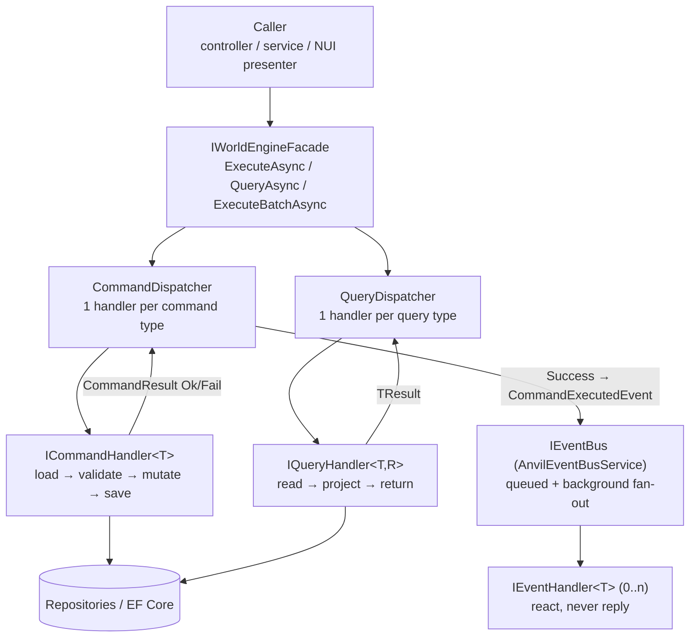
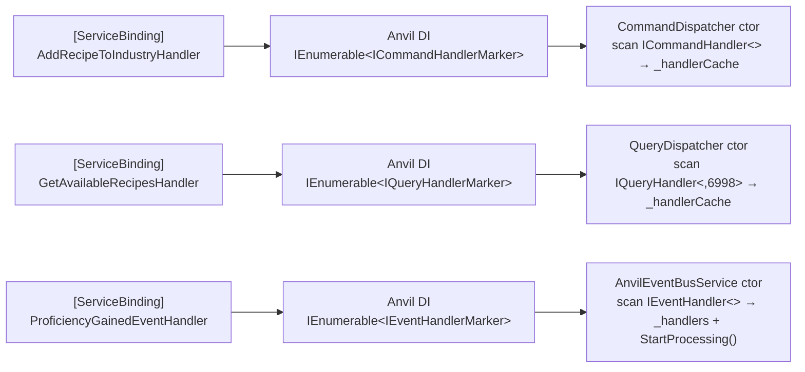
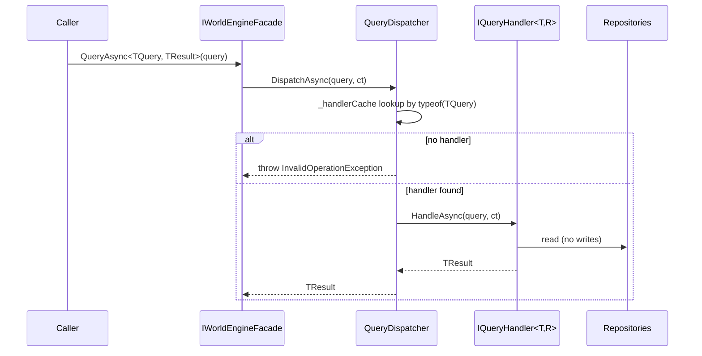

# CQRS Overview — WorldEngine

WorldEngine separates **writes** (commands), **reads** (queries), and **reactions** (events).
All three route through small dispatchers discovered at startup via marker interfaces.
Single entry point for callers: `IWorldEngineFacade`.

Source of truth: `Features/WorldEngine/SharedKernel/` (`Commands/`, `Queries/`, `Events/`),
`Features/WorldEngine/Services/AnvilEventBusService.cs`,
`Features/WorldEngine/WorldEngineFacade.cs`.

## Big picture



| Piece | Type | Contract |
|---|---|---|
| Command | `ICommand` (record, marker) | Intent to mutate; imperative name (`CraftItemCommand`). |
| Command handler | `ICommandHandler<TCommand> : ICommandHandlerMarker` | `HandleAsync(cmd, ct) → CommandResult`. Exactly one per command type (last registration wins). |
| Command dispatcher | `ICommandDispatcher` → `CommandDispatcher` | Cached `MethodInfo` invoke; **never throws** — exceptions become `CommandResult.Fail`. Publishes `CommandExecutedEvent<T>` on success only. |
| Query | `IQuery<TResult>` (record, marker) | Pure read; no persistence side effects. |
| Query handler | `IQueryHandler<TQuery, TResult> : IQueryHandlerMarker` | `HandleAsync(query, ct) → TResult`. Exactly one per query type. |
| Query dispatcher | `IQueryDispatcher` → `QueryDispatcher` | Cached invoke; **throws** on missing handler or handler exception (unwraps `TargetInvocationException`). Publishes nothing. |
| Domain event | `IDomainEvent` (`EventId`, `OccurredAt`) | Past-tense fact (`ResourceHarvestedEvent`). |
| Event handler | `IEventHandler<TEvent>` | `HandleAsync(evt, ct) → Task`. Zero-to-many per event. Errors are logged per-handler, never break siblings. |
| Event bus | `IEventBus` → `AnvilEventBusService` | `PublishAsync` only enqueues + signals; a background `Task` loop dequeues and fans out. `Subscribe()` is intentionally unimplemented — use `IEventHandler<T>`. |

## Startup: discovery and caching

No manual registration. Anvil DI injects every handler as an enumerable via the marker
interface; each dispatcher reflects once at construction and caches `HandlerInvocation`
(handler instance + `MethodInfo` + handled type).



Files: `SharedKernel/Commands/CommandDispatcher.cs` (`DiscoverAndCacheHandlers`),
`SharedKernel/Queries/QueryDispatcher.cs`, `Services/AnvilEventBusService.cs`.

## Command pipeline

```mermaid
sequenceDiagram
    participant C as Caller
    participant F as IWorldEngineFacade
    participant D as CommandDispatcher
    participant H as ICommandHandler<T>
    participant R as Repositories
    participant B as IEventBus
    participant EH as Event handlers

    C->>F: ExecuteAsync(command)
    F->>D: DispatchAsync(command, ct)
    D->>D: _handlerCache lookup by typeof(TCommand)
    alt no handler
        D-->>F: CommandResult.Fail("No handler registered…")
    else handler found
        D->>H: HandleAsync(command, ct) via cached MethodInfo
        H->>R: load → validate → mutate → save
        H-->>D: CommandResult.Ok(data?) / Fail(error)
        alt result.Success
            D->>B: PublishAsync(CommandExecutedEvent<T>(command, result))
            Note over B,EH: enqueue + SemaphoreSlim signal; background loop fans out
        end
        D-->>F: CommandResult
        F-->>C: CommandResult
    end
```

Rules:

- Handler returns `Fail` for domain rejection (not found, not a member, missing knowledge).
  Dispatcher converts **thrown** exceptions into `Fail("Command execution failed: …")`.
- Event publish failure is swallowed (warn log) — it never fails the command.
- `CommandResult` shape: `{ Success, ErrorMessage?, Data? }` with `Ok()`, `OkWith(key, value)`, `Fail(msg)`.
- Batch: `ExecuteBatchAsync(cmds, options?, ct)` loops `DispatchAsync` sequentially
  (`MaxDegreeOfParallelism`/`UseTransaction` are declared on `BatchExecutionOptions` but the
  current loop is sequential with `StopOnFirstFailure` + cooperative cancellation).
  Returns `BatchCommandResult` (`TotalCount`, `SuccessCount`, per-command results, `cancelled` flag).

## Query pipeline



Rules: queries publish no events, return empty collections (not failures) for "not found"
filters, and let exceptions propagate to the caller after logging.

## Event pipeline

```mermaid
sequenceDiagram
    participant P as Publisher<br/>(handler / subsystem)
    participant B as AnvilEventBusService
    participant Q as ConcurrentQueue + SemaphoreSlim
    participant L as Background loop
    participant H1 as Handler A
    participant H2 as Handler B

    P->>B: PublishAsync(evt)
    B->>Q: Enqueue + Release()
    Q->>L: WaitAsync() wakes
    L->>L: TryDequeue → ProcessEventAsync
    alt no handlers for evt type
        L-->>L: trace + drop
    else handlers exist
        L->>H1: HandleAsync(evt, CancellationToken.None)
        L->>H2: HandleAsync(evt, CancellationToken.None)
        Note over L,H2: sequential per event; one handler's throw is caught + logged, siblings still run
    end
```

Notes:

- `PublishAsync` returns immediately after enqueue — subscribers run **asynchronously**,
  so don't expect read-your-write from an event.
- Handlers needing NWN object access must switch to the main thread
  (`NwTask.SwitchToMainThread`) — the bus loop runs on a background thread.
- Two event kinds: **domain events** emitted by handlers/subsystems
  (`ResourceHarvestedEvent`, `ProductionRecordedEvent`, `ProficiencyGainedEvent`, …)
  and the automatic **`CommandExecutedEvent<TCommand>`** wrapper the `CommandDispatcher`
  publishes on every successful command (subscribe to it for generic auditing/side effects).

## Calling it

```csharp
// Write
CommandResult r = await worldEngine.ExecuteAsync(new CraftItemCommand
{
    CharacterId = characterId,
    IndustryTag = new IndustryTag("smithing"),
    RecipeId    = recipeId,
    InputQualities = [80, null],
});
if (!r.Success) { /* r.ErrorMessage */ }

// Read
List<Recipe> available = await worldEngine
    .QueryAsync<GetAvailableRecipesQuery, List<Recipe>>(new GetAvailableRecipesQuery
    {
        CharacterId = characterId,
        IndustryTag = new IndustryTag("smithing"),
    });

// Batch
BatchCommandResult batch = await worldEngine.ExecuteBatchAsync(commands,
    BatchExecutionOptions.ContinueOnFailure());
```

Controllers stay thin: validate auth/route/body, call the facade, map `CommandResult`/`TResult`
to `ApiResult` (see `API/Controllers/*`).

## Worked example: `CraftItemCommand`

`Application/Industries/Commands/CraftItemCommand.cs` (record + co-located `CraftItemHandler`):

1. Load `Industry` by tag → `Fail` if missing; resolve recipe from industry or
   `RecipeTemplateExpander` cache → `Fail` if missing.
2. Check `IIndustryMembershipRepository` → `Fail` if not a member.
3. Check `ICharacterKnowledgeRepository` covers `recipe.RequiredKnowledge` → `Fail` listing gaps.
4. Aggregate `CraftingModifier`s → `CraftingQuality.ComputeBaseQuality(inputQualities)` →
   `ICraftingProcessor` (quality bonus, quantity multiplier, success roll).
5. Award knowledge progression + proficiency XP, return `OkWith(...)`.
6. Dispatcher publishes `CommandExecutedEvent<CraftItemCommand>`; handlers like
   `ProficiencyGainedEventHandler` / `RecipeLearnedEventHandler` react (codex, quests, sim feed).

Pair query: `GetAvailableRecipesQuery` filters `industry.Recipes` by membership +
known-knowledge tags — pure read, no events.

## Which tool when

- **Command** — state changes or can fail for domain reasons. Returns `CommandResult`.
- **Query** — pure read. Returns `TResult` directly.
- **Event** — something already happened; N consumers should react without coupling to the producer. Prefer a domain event over calling another subsystem directly.
- **Subsystem method** — narrow in-process operation owned by one boundary (e.g. price math).
  Cross-boundary coordination goes through the facade or events, never subsystem→subsystem.

## File map

| Concern | Location |
|---|---|
| Facade | `Features/WorldEngine/IWorldEngineFacade.cs`, `WorldEngineFacade.cs` |
| Command kernel | `SharedKernel/Commands/` (`ICommand`, `ICommandHandler`, `ICommandDispatcher`, `CommandDispatcher`, `CommandResult`, `BatchExecutionOptions`, `BatchCommandResult`) |
| Query kernel | `SharedKernel/Queries/` (`IQuery`, `IQueryHandler`, `IQueryDispatcher`, `QueryDispatcher`) |
| Event kernel | `SharedKernel/Events/` (`IDomainEvent`, `IEventHandler`, `IEventBus`, `CommandExecutedEvent`, `InMemoryEventBus` test double) |
| Bus | `Services/AnvilEventBusService.cs` |
| Handlers | `Application/<Domain>/{Commands,Queries,Handlers}/` (e.g. `Application/Industries/`, `Application/Organizations/`, `Application/Items/`) |
| Prior docs | `Docs/WorldEngine-cqrs.md`, `Docs/WorldEngine-architecture.md`, `Docs/WorldEngine-subsystems.md` |
