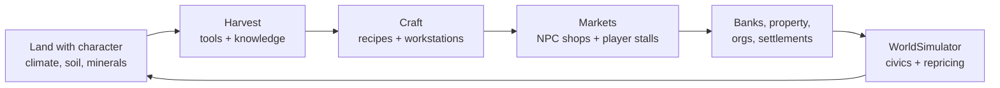

# Game Design: the ideas behind PwEngine

This is a reading of the design philosophy expressed by the code — not a spec. Sources: `Industries-Crafting-README.md`, `Personas-README.md`, `WorldEngine-codex.md`, `WorldEngine-architecture.md`, Simulator requirements, and the Harvest → Craft → Market implementation.

## 1. The core fantasy: a player-run supply chain inside a living world

Everything points at one loop:

The world is not a vending machine (kill mob → loot). It's a **supply chain**: geography deals the cards (where the mithral is, which soil grows what), players extract, refine, move, and sell, and the surplus pools into organizations and settlements that then act (dominion turns, diplomacy, intrigue). The Simulator exists precisely to close that loop — civic stats, influence, and market prices react to what players actually harvested, produced, and traded.

Three corollaries:

- **Geography creates trade.** Mineral quality ranges, climate, and soil quality are per-area. No single region is self-sufficient, so hauling and player stalls have a reason to exist.
- **Quality is physical.** `EconomyQuality` rides on the item itself (`item_quality` / `item_material` / `item_maker` local vars), from node roll through ingredient selection to finished product. A masterwork sword remembers it was once good ore.
- **The economy is observable.** Transaction history, the Codex Economy tab, shop prices, and civic snapshots all expose the same ledger — players and DMs can see the machine working.

## 2. Everyone is an actor: Personas

The most structural idea in the codebase is the **Persona**: players, characters, organizations, governments, settlements, even NPCs are all actors behind one `PersonaId` gateway (`Personas-README.md`). Why:

- A bank account can belong to a character *or* a guild *or* a settlement without three account systems.
- Membership, diplomacy, influence, and property all resolve to persona-to-persona relations.
- The Simulator's dominion turns (Territory → Region → Settlement → Organization → Market) iterate personas, not special cases.

Design bet: **power should be transferable**. A guild treasury, a stall co-op, a rented hall — all are just personas holding assets and permissions, so player institutions can form without DM intervention.

## 3. Two-axis progression: Knowledge (wide) vs. Proficiency (tall)

Grinding one XP bar is explicitly rejected. Instead:

| Axis | What it is | Shape |
| --- | --- | --- |
| **Knowledge** | Learnable articles in a per-industry DAG with prerequisites and named branches (e.g. Bladesmith vs. Armorsmith) | Horizontal: unlocks recipes, widens harvest/craft bonuses, grants codex lore; costs points with **soft caps** (diminishing) and **hard caps** (stop) |
| **Proficiency** | Skill tier `Layman (0.6) → Novice (0.8) → Apprentice (1.0) → Journeyman (1.1) → Expert (1.2) → Master (1.5) → Grandmaster (1.8)` | Vertical: multiplies output quality; XP curves per level; **tier ceilings require rank-up** — you can't out-grind your rank |

Knowledge effects bridge subsystems: learning something can unlock a recipe, alter harvest yield/quality/rate, or drop a codex entry. Crafting modifiers stack the same way. The intent is **specialization with identity** — two masters of one industry with different branches play differently — while caps prevent runaway generalists.

## 4. Crafting as play, not as spreadsheet

The crafting README states the philosophy outright (Fantasy Life-inspired):

> **Engaged players get better outcomes; passive players still succeed.**

- A progress bar (0 → 100) with **action windows**: apply HAMMER/QUENCH/etc. at the right moment for quality/trait bonuses; mistiming penalizes; **doing nothing is always safe** (baseline by skill tier).
- Process graphs (linear, branching, cyclic) so recipes feel like techniques to learn, not shopping lists. Per-ingredient **quality selection** means input choice matters.
- Recipe **templates** (`Wood + Log → Plank` expands per wood type) let designers add content via JSON/data without code — iteration lives with designers, not engineers.
- Tools are required but not consumed; workstations gate *where* (a forge is shared across industries, stored in its own table).

Note the honesty in the code: the minigame engine (Phases 1–6) is designed but unchecked — current crafting is instant with the same quality math. The design still governs: input quality + knowledge + tier = output, never punishment for trying.

## 5. Harvesting as place: tools, rounds, and depletion

Harvesting mirrors the crafting ethos at smaller scale:

- **Right tool, right place**: pick + steel for mithral, axe for trees, hands for herbs. The requirement is data (node JSON), so new resources don't need code.
- **Rounds, not clicks**: minerals take N ticks of progress (knowledge can speed this); flora is instant; trees fell once and pay logs by quality. `Uses` counters make veins deplete — extraction has a footprint.
- **Progress is visible**: a shared NUI progress bar with auto-close on wander/inactivity keeps gathering ambient, not modal.

## 6. Markets with landlords: stalls, rent, and reeves

Player stalls are the most "designed" economy object (aggregate + claim flow + inventory custodian + escrow + rent renewal + suspension). The ideas:

- **Commerce needs custody**: listed goods leave your inventory into policy-guarded custody (restorable, backfillable) — the market, not chat spam, is the trusted middleman.
- **Space has rent**: stalls and rentable properties charge, renew from escrow, and suspend on non-payment with foreclosure storage rather than deletion. Scarcity without cruelty.
- **Friction is gameplay**: reeve lockups, member roles, blacklists, and restock strategies are all levers DMs can tune per market.

NPC shops run the same price pipeline (base → modifier chain → floor 0), so DM-run and player-run commerce rhyme.

## 7. The Codex: one journal for everything you are

The Codex (6 tabs: Knowledge, Quests, Notes, Reputation, Traits, **Economy**) is the player-facing half of the design: your lore unlocks, quest stages, traits, faction standing, and economic footprint in one NUI window, fed by the same events as everything else (harvests, productions, dialogue choices). Dynamic quests (post → claim → share → expire) plus 7 objective evaluators and stage rewards (XP/gold/KP/proficiency) make it a quest engine, not a diary. Chat (`./codex`), journal toggle, and AdminPanel CRUD keep DMs in the loop.

## 8. Simulation without lag: off-process consequences

Heavy turns (dominion hierarchy walks, civic aggregation over loyalty/security/manpower/prosperity/happiness/military/arcane/defense, influence resolution, supply/demand repricing) explicitly do **not** run on the game server. The Simulator owns its DB, consumes engine events, and answers with commands (`RepriceMarketInventoryCommand`) and outcome events. Design idea: **the world reacts off-screen, on schedule** — markets reprice, settlements shift, turns resolve — while the NWN process stays responsive. Out of scope on purpose: player UI and direct script execution live with the game server.

## 9. Platform ideas (how it stays buildable)

- **One facade, eleven subsystems, zero cross-talk**: game code injects `IWorldEngineFacade` and calls commands/queries; subsystems never reference each other (coordination via facade, events, Personas). New systems arrive by dropping in a class with `[ServiceBinding]`.
- **Data over code**: nodes, recipes, templates, workstations, regions, blueprints are JSON/tables; the engine expands and validates them. Content velocity matters more than cleverness.
- **DMs are operators**: AdminPanel HTTP API (keyed, routable controllers), DM tool windows, area reload, dependency graph — the live team can inspect and intervene.
- **NWN is respected, not fought**: main-thread marshaling (`NwTask`), placeable-based nodes, trigger provisioning with spacing caps, Scry NUI framework with auto-close, local-var sanitization before persistence.

## 10. The sentence version

**A persistent world where place matters, work compounds, and institutions outlive sessions** — geography deals uneven resources, knowledge and skill multiply labor, markets and banks pool the surplus into personas that act back on the world, and every step is visible in the Codex and priced by the Simulator.
