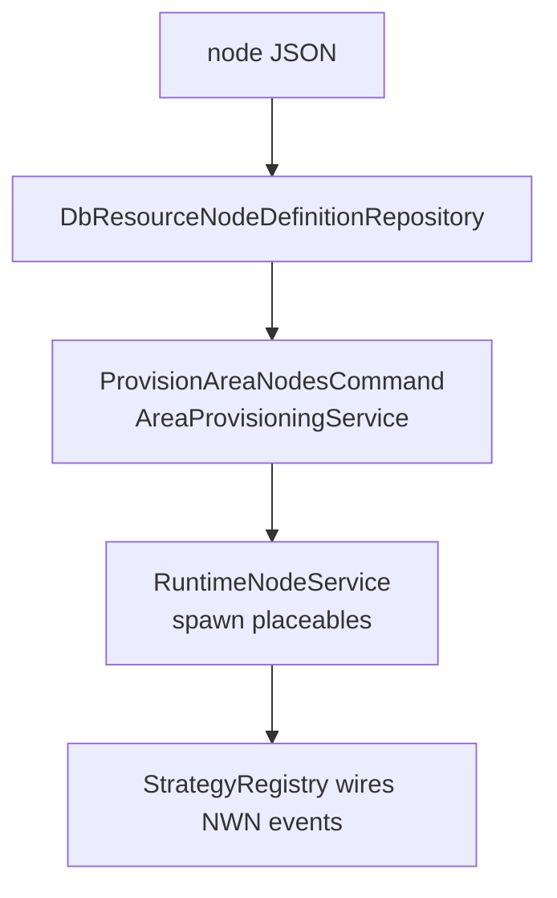
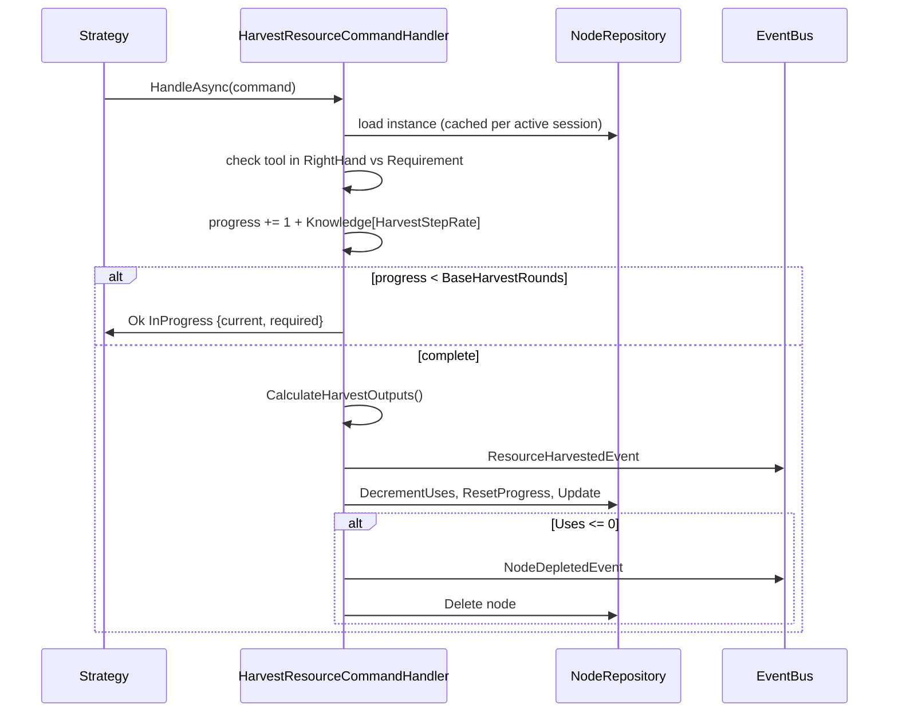

# Harvesting

How raw materials enter the economy: resource-node definitions → spawned placeables → per-type gather interaction → `HarvestResourceCommand` loop → quality/quantity-modified outputs → `ResourceHarvestedEvent` downstream (inventory, codex, quests, simulator).

Code: `Features/WorldEngine/Subsystems/Harvesting/`, `Features/WorldEngine/Subsystems/ResourceNodes/`, node JSON in `Resources/WorldEngine/Nodes/`.

## 1. Data model

**Definition** (`ResourceNodes/ResourceNodeData/ResourceNodeDefinition.cs`, JSON per node):

| Field | Meaning |
| --- | --- |
| `Tag` | Unique id, e.g. `ore_vein_mithral` |
| `Type` | `Ore` / `Geode` / `Boulder` / `Tree` / `Flora` |
| `PlcAppearance` | Placeable appearance id |
| `Requirement` (`HarvestContext`) | `RequiredItemType` (`ToolPick`, …) + optional `RequiredItemMaterial` (`Steel`); `ItemForm.None` = bare hands |
| `Outputs[]` (`HarvestOutput`) | `{ItemDefinitionTag, Quantity, Chance}` — chance < 100 rolls per output |
| `Uses` | Harvest cycles before depletion (default 50; trees always 1) |
| `BaseHarvestRounds` | Progress ticks per cycle (e.g. mithral = 10) |
| `Min/MaxQuality` | Optional clamp override; else global `CraftingQuality.Min/MaxCraftable` |

**Instance** (`ResourceNodeInstance.cs`): `{Id, Area, Definition, X/Y/Z/Rotation, Uses, Quality (IPQuality), HarvestProgress (private counter)}` with `Increment/ResetHarvestProgress()`, `DecrementUses()`, `GameLocation()`.

**Quality** (`EconomyQuality` → `IP_CONST_QUALITY_*`): `GetQualityForArea(area)` rolls it at spawn — ore/geode/boulder from `area.Environment.MineralQualityRange`; flora penalized for wrong `Climate` or `SoilQuality` below `RequiredSoilQuality`; everything clamped via `ClampQuality()`.

Example (`Resources/WorldEngine/Nodes/Ore/node_ore_mithral.json`): mithral vein, needs `ToolPick + Steel`, 10 rounds → `mithral_ore x1 @100%`.

## 2. Provisioning (how nodes get into the world)

- `ProvisionAreaNodesCommandHandler` / `AreaProvisioningService` / `TriggerBasedSpawnService` / `ResourceNodeInstanceSetupService` spawn `SpawnedNode{Instance, Placeable}` pairs at module load / area provision.
- `NodeHarvestStrategyRegistry` picks a strategy by `ResourceType` and wires the placeable's NWN event. `RuntimeNodeService` maps placeable UUID → node for the handlers.
- Queries: `GetNodeById`, `GetNodesForArea`, `GetNodeState`; commands: `RegisterNode`, `DestroyNode`, `ClearAreaNodes`.

## 3. Gather interactions (per type)

| Type | Strategy | Player action | Cycle behavior |
| --- | --- | --- | --- |
| Ore / Geode / Boulder | `MineralHarvestStrategy` | Physically attack the placeable (`OnPhysicalAttacked`) | Each hit = 1 `HarvestResourceCommand`; progress accumulates; multi-`Uses` |
| Tree | `TreeFellingStrategy` | Attack/chop (`OnPhysicalAttacked`) | Chop for `BaseHarvestRounds`, then tree felled (destroyed, single-use); log count = `TreeProperties{MinLogs, MaxLogs, LogItemTag}` scaled by quality |
| Flora | `FloraGatherStrategy` | Use/click (`OnUsed`) | Instant single harvest, plant removed — no combat |

All strategies resolve the `RuntimeCharacter`, check the tool, dispatch the command, then show/update a `HarvestProgressPresenter/View` bar (one per player, auto-closes on move/inactivity) and grant outputs on completion.

## 4. Harvest loop

`Harvesting/Application/HarvestResourceCommandHandler.cs` handles `HarvestResourceCommand(HarvesterId, NodeInstanceId)`:

Notes:

- Active sessions are cached in a static dict so transient `HarvestProgress` survives across hits; removed on completion/depletion.
- Tool check: if `RequiredItemType != ItemForm.None`, the character's `RightHand` item type must match or the command fails (`"Required tool not equipped"`). Dead characters can't harvest (upstream guard).
- Result statuses: `InProgress` (with `currentProgress`/`requiredProgress`), `Completed` (with `remainingUses`), `NodeDepleted`.

## 5. Output calculation

`CalculateHarvestOutputs(node, character)` per `HarvestOutput`:

1. **Chance roll** — if `Chance < 100`, `Random.Shared.Next(100) >= Chance` skips the output.
2. **Quality** — start at `node.Quality`, add `KnowledgeHarvestEffect`s where `StepModified == Quality` (Additive `+= value`, PercentMult `+= total * value`), then `Definition.ClampQuality()`.
3. **Quantity** — start at `harvestOutput.Quantity`, add `Knowledge[ItemYield]` effects the same way.
4. Emit `HarvestedItem(ItemDefinitionTag, Quantity, IPQuality)`.

Knowledge effects come from `character.KnowledgeEffectsForResource(node.Tag, node.Type)` — matched by `NodeTagPattern` (exact tag or wildcard), so specialization (e.g. "+1 yield on silver veins") stacks with generic ("+1 quality on all ore"). The same hook also speeds gathering (`HarvestStepRate`).

## 6. Downstream

- `ResourceHarvestedEventHandler` / `NodeDepletedEventHandler` / `NodeRegisteredEventHandler` — inventory grant, placeable cleanup, respawn bookkeeping.
- `ResourceHarvestedEvent` + `ProductionRecordedEvent` feed quest objectives (collect), codex progression, and the WorldSimulator's supply-side analytics (repricing loop).
- Trees bypass the generic output calc (log roll from `TreeProperties`), but still emit the same events.

## 7. Cheat sheet

| Want… | Where |
| --- | --- |
| Send a harvest tick | `HarvestResourceCommand(HarvesterId, NodeInstanceId)` |
| Add a node type | JSON in `Resources/WorldEngine/Nodes/<Ore/Geodes/Trees>/node_*.json` + `ProvisionAreaNodesCommand` |
| Change tool gating | `Requirement` in the node JSON (`ToolPick`/`ToolAxe`/… + material) |
| Change rounds/uses | `BaseHarvestRounds`, `Uses` in JSON |
| Add knowledge bonus | `KnowledgeSubsystem/KnowledgeHarvestEffect` with `StepModified` = `HarvestStepRate` / `Quality` / `ItemYield` |
| Per-type behavior | `Harvesting/Strategies/{Mineral,TreeFelling,FloraGather}Strategy.cs` |
| Progress-bar UI | `Harvesting/Nui/HarvestProgress{Presenter,View}.cs` |
| Tests | `Harvesting/Tests/Harvesting/{HarvestingCqrsTests,WildcardHarvestEffectTests}.cs` |
