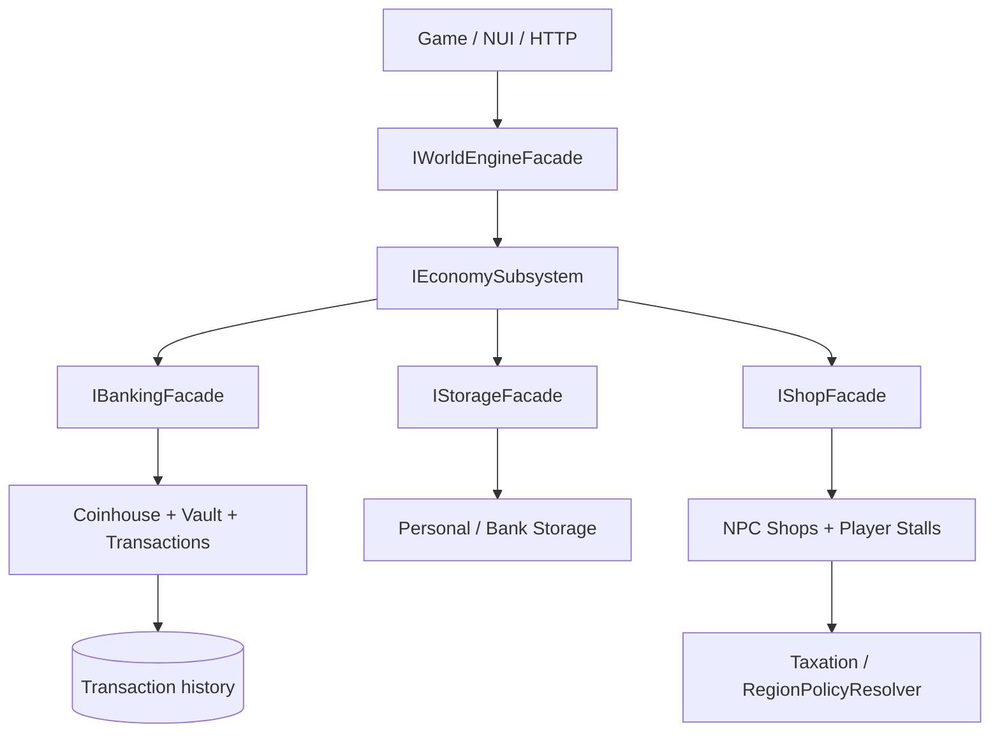
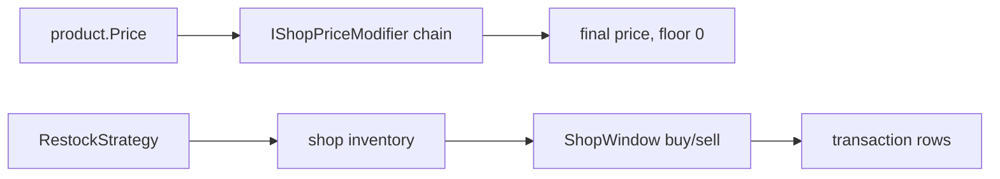

# Economy Systems

WorldEngine's `IEconomySubsystem` (`Features/WorldEngine/Subsystems/Economy/`) is an umbrella over three facades. All writes are CQRS commands through `IWorldEngineFacade.ExecuteAsync`; reads are queries; side effects are domain events.

## 1. Entry points

| Facade | Interface | Covers |
| --- | --- | --- |
| Banking | `Facades/IBankingFacade.cs` | Coinhouse accounts, holders/roles, deposit/withdraw, balances, eligibility |
| Storage | `Facades/IStorageFacade.cs` | Store/withdraw items, capacity upgrades |
| Shops | `Facades/IShopFacade.cs` | Claim/release stalls, list products (NPC shops mostly via services, not facade) |

Impl: `EconomySubsystem` (thin aggregator), `Implementation/{BankingFacade,StorageFacade,ShopFacade}.cs`, seeded by `EconomyBootstrapService.cs`.

## 2. Money: GoldAmount, transactions, treasuries

- `ValueObjects/GoldAmount.cs` — non-negative int wrapper (`Parse`, `Add`, `Subtract` throws on negative, `CanAfford`). `TransactionId`, `TransactionReason` alongside.
- Commands: `DepositGoldCommand`, `WithdrawGoldCommand`, `DepositToVaultCommand`, `WithdrawFromVaultCommand`, `TransferGoldCommand` (each with `*Handler`). Events: `GoldDepositedEvent`, `GoldWithdrawnEvent`, `GoldTransferredEvent`.
- `Transactions/TransactionRepository` + `GetTransactionHistoryQuery` — audit log backing the Codex Economy tab and the Simulator repricing feed.
- `Treasuries/VaultService` + `VaultRepository` (`GetVaultBalanceQuery`) — settlement/org vaults, distinct from personal coinhouse balances.

Rule of thumb: coinhouse = personal/shared spendable accounts; vault = org/settlement treasury; every movement emits an event + transaction row.

## 3. Banking / coinhouse

`Implementation/Banks/`:

- `CoinhouseService` — account lifecycle; `Access/` (`BankAccessEvaluator`, `BankRolePermissions`, `OrganizationBankRoles`, `SharedAccountDocumentService`) — who can do what.
- Account holder flow: `OpenCoinhouseAccountCommand` → `JoinCoinhouseAccountCommand` (share-document activation) → `UpdateCoinhouseAccountHolderRoleCommand` (no self-promotion to Owner) / `RemoveCoinhouseAccountHolderCommand` (can't remove sole owner). Eligibility via `GetCoinhouseAccountEligibilityQuery`.
- Reads: `GetCoinhouseAccountQuery`, `GetAccessibleAccountsQuery` (personal + shared at one coinhouse), `GetCoinhouseBalancesQuery`, `GetBalanceQuery`.
- UI: `UI/Banking/` (`BankWindowView/Presenter`, `BankStorageWindowView`, `BankAdminWindowView`, `BankAccountModel`).
- HTTP: `API/Controllers/CoinhouseController.cs`.

## 4. NPC shops

`Implementation/Shops/` (non-stall part):

- Domain: `NpcShop` + `NpcShopDefinition`, `NpcShopProduct` (price, resref), `NpcShopRepository`, `ShopkeeperService`, `ShopLocationResolver`.
- Pricing pipeline: `ShopPriceCalculator` runs base `product.Price` through `IShopPriceModifier[]` (e.g. `ShopMarkupPriceModifier`); a throwing modifier is logged and skipped, floor is 0. Context is `ShopPriceContext(shop, product, buyer)` so buyer-specific discounts are possible.
- Inventory: `NpcShopItemFactory` (+ `NwItemWriters`, appearance/local-var writers), `ShopItemBlacklist`, `InterimRandomRestockStrategy` / `NpcShopRestockService` (blueprint fallback + merge covered in `Tests/Shops/NpcShopBlueprint*Tests`).
- NUI: `Shops/Nui/ShopWindowPresenter/View`.

## 5. Player stalls (market stalls)

`Implementation/Shops/PlayerStalls/` — the richest flow, DDD aggregate style:

- Aggregate: `PlayerStallAggregate` + `PlayerStallService` (+ `PlayerStallClaimFlow`, `PlayerStallInitializer`, `PlayerStallInventoryPolicy`, `PlayerStallInventoryCustodian`).
- Commands: `ClaimPlayerStallCommand`, `ReleasePlayerStallCommand`, `ListStallProductCommand`, plus rent group: `DepositStallRentCommand`, `PayStallRentCommand`, `Add/RemoveStallMemberCommand`, `SuspendStallForNonPaymentCommand` (test status: `Tests/Shops/PlayerStalls/RENT_COMMAND_TESTS_COMPLETE.md`).
- Money side: `ReeveFundsService` (escrow), `ReeveLockupService` + `MarketReeveLockupWindowConfig`, `MarketReeveInteractionService`, `PlayerStallRentRenewalService` (periodic renewal/suspension).
- Inventory safety: `StallProductRestorer`, `StallProductBackfillService`, `PlayerStallItemLocals`; events: `StallRentPaid`, `StallEscrowDeposited`, `StallSuspended`, `StallOwnershipReleased`, `StallMemberAdded/Removed`.
- NUI: `Nui/{PlayerBuyerView/Presenter, PlayerSellerView/Presenter, RentStallWindowView, MarketReeveLockupView}`; facade surface is claim/release/list (rent ops go through commands directly).

Typical loop: claim → list products (inventory custodied) → buyers purchase → proceeds to escrow/reeve → rent auto-renewed from escrow → non-payment suspends → release returns inventory.

## 6. Storage

`Implementation/Storage/`:

- `PersonalStorageService` (`IPersonalStorageService`): `StoreItemCommand`, `WithdrawItemCommand`, `UpgradeStorageCapacityCommand`; reads `GetStoredItemsQuery`, `GetStorageCapacityQuery`.
- Guards: `BankStorageItemBlacklist` (what can't be stored), `ForeclosureStorageService` (what happens on property loss), `LegacyStoredItemConversionService` (Core `StoredItem` → engine model).
- `StorageLocationType` distinguishes bank vs. personal vs. stall lockup.

## 7. Property rental

`Implementation/Properties/`:

- Definition: `RentablePropertyDefinition`, `PropertyCategory`, `PropertyId`, `SettlementTag`; snapshot: `RentablePropertySnapshot`, `RentalAgreementSnapshot`, `PropertyOccupancyStatus`.
- Flow: `RentPropertyCommand` → `PayRentCommand` → `EvictPropertyCommand` (via `PropertyEvictionService`). Policy: `PropertyRentalPolicy` + `PropertyRentalLimitsConfig/Provider`, capability check `RentalPaymentCapabilityService` (`RentalPaymentMethod`, `PaymentCapabilitySnapshot`), activity `PropertyResidentActivityTracker`.
- Persistence: `IRentablePropertyRepository` (`PersistentRentablePropertyRepository` in `Database/`); reads `GetPropertyByPoiQuery`; NUI `PayRentWindowView`, `RentPropertyWindowView`.

## 8. Taxation / region policy

`Implementation/Taxation/RegionPolicyResolver.cs`: maps coinhouse tag → settlement → `RegionTag` (via `ICoinhouseRepository` + `RegionIndex`) for policy lookup. Region-scoped pricing/tax behavior consumes this; the WorldSimulator closes the loop with demand/supply analytics → `RepriceMarketInventoryCommand` → `MarketPricesAdjustedEvent` (see `WorldSimulator/SimulatorRequirements.md`).

## 9. Command / query / event cheat sheet

| Area | Commands | Queries | Events |
| --- | --- | --- | --- |
| Banking | Open/Join/RemoveHolder/UpdateRole, Deposit/WithdrawGold | Balances, AccessibleAccounts, Eligibility, Balance | GoldDeposited/Withdrawn/Transferred, HolderRemoved/RoleChanged |
| Vault/treasury | DepositToVault, WithdrawFromVault, TransferGold | GetVaultBalance, GetTransactionHistory | same gold events |
| Stalls | Claim/Release/List, Deposit/PayRent, Add/RemoveMember, Suspend | via services | RentPaid, EscrowDeposited, Suspended, OwnershipReleased |
| Storage | Store/WithdrawItem, UpgradeCapacity | StoredItems, StorageCapacity | — |
| Property | Rent/PayRent/Evict | GetPropertyByPoi | — |

## 10. Where to look

| Want… | File |
| --- | --- |
| Facade methods | `Subsystems/Economy/Facades/*.cs` |
| Shop pricing | `Implementation/Shops/ShopPriceCalculator.cs`, `ShopMarkupPriceModifier.cs`, `ShopPriceContext.cs` |
| Stall domain | `Implementation/Shops/PlayerStalls/PlayerStallAggregate.cs`, `PlayerStallService.cs` |
| Storage rules | `Implementation/Storage/PersonalStorageService.cs`, `BankStorageItemBlacklist.cs` |
| Rent rules | `Implementation/Properties/PropertyRentalPolicy.cs`, `PropertyEvictionService.cs` |
| Tests | `Subsystems/Economy/Tests/` (Commands, Queries, Shops, StorageTests, Treasuries, Properties) |
