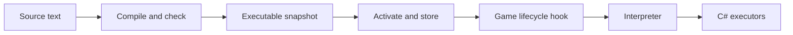

# Glyph architecture

Glyph lets an author describe game behavior in a small language. C# translates that description
into a checked execution plan; a game event supplies the live data and runs the plan. The same
registered descriptions tell the compiler, editor, and reference documentation what is available.

Read this as a map of the system. Use [Adding features](ADDING_FEATURES.md) for implementation
steps and the [language reference](Language/API_REFERENCE.md) for exact syntax and API signatures.

## Follow one script

```glyph
glyph greeting : interaction {
    completed {
        if nwn.get_is_object_valid(player) {
            message(player, "Welcome")
        }
    }
}
```

This says: when an interaction completes, check the player's current object handle and send a
message. Four different jobs make that happen:



### 1. Understand the words

The **lexer** splits text into tokens: `if`, a name, a parenthesis, a string. The **parser** groups
those tokens into a syntax tree: an interaction script containing a completed stage and a branch.
It understands sentence structure, but does not establish whether the named function exists.

The **binder** supplies meaning. It resolves `message`, checks argument types, finds what `player`
means in this event, and checks which operations are allowed in this stage. It also resolves
modules, struct fields, ADT variants, methods, and generic arguments. Its output is a typed tree:
every expression now has a known meaning and type.

Start at [GlyphCompiler](Language/Compilation/GlyphCompiler.cs). The lexer/parser are in
`Language/Parsing/`; the typed tree and checker are in `Language/Binding/`.

### 2. Turn meaning into a runnable plan

The **lowerer** translates the typed tree into a `GlyphGraph`. This is the intermediate
representation, or **IR**: the instructions between source code and execution. Nodes are operations;
execution edges say what runs next, and data edges say where an input comes from. A **pin** is a
named input or output on an operation.

`GlyphIrValidator` checks that the plan's node types, pins, connections, and entries make sense.
Only successful compilation produces a `GlyphExecutable`. That snapshot keeps the plan privately
serialized, along with source locations and its locked module dependencies. Each run receives its
own graph copy. Runtime graphs are derived data; authors edit source.

See [GlyphLowerer](Language/Lowering/GlyphLowerer.cs), [GlyphIrValidator](Core/GlyphIrValidator.cs),
and [GlyphExecutable](Runtime/Programs/GlyphExecutable.cs).

### 3. Publish the plan and attach it to the game

Saving a draft and activating a script are separate operations. Activation compiles the candidate,
persists its published history, then makes the executable available through `GlyphRuntimeRegistry`.
Rollback selects a retained executable. At startup, published source and its dependency lock are
used to rebuild executable snapshots.

An integration hook connects a game lifecycle event to an active script. Encounter, trait, and
interaction hooks select the relevant bindings, construct an execution context, and invoke the
interpreter. An interaction's `attempted`, `started`, `tick`, and `completed` stages are invoked
independently by their corresponding lifecycle hooks.

See `API/`, `Persistence/`, `Integration/`, and `Runtime/Programs/`.

### 4. Execute with live data

`GlyphInterpreter` follows execution edges and asks registered C# **executors** to perform the
operations. Data inputs can be resolved on demand; actions run along the execution path. Runtime
nodes also implement variable storage, loops, function calls, matching, and collection operations.
Execution has cancellation and resource limits.

`GlyphExecutionContext` is the backpack for one execution: variables, caches, tracing, and typed
game data. Hooks attach domain data with `Set<T>()`; executors read it with `Get<T>()`. These typed
attachments are called **capabilities**. They let a subsystem supply information without adding
another domain-specific property to Glyph core.

`Object` is an NWN handle. `Option<Object>.Some(...)` records a value's presence; it does not keep
the underlying object alive. Check current validity when behavior depends on its continued existence.

## Where the vocabulary comes from

An intrinsic is a C# operation that Glyph source can call. Its **descriptor** declares its source
name, typed parameters, result, availability, and documentation. Its executor supplies the behavior.
Build-time generators register marked executors and modules. `GlyphBootstrap` assembles them,
verifies their contracts, and creates the compiler, interpreter, and editor metadata.

| Area | Responsibility |
| --- | --- |
| `Platform/` | Operation descriptors, event/context contracts, registration, verification |
| `Nwn/` | Reviewed native bindings, handle/value conversions, handwritten adapters |
| `Runtime/Nodes/` | Built-in operation implementations |
| `Features/WorldEngine/Subsystems/*/Glyph/` | Subsystem-owned operations and narrow service APIs |
| `tools/Glyph.Generators/` | Generate registration and native bindings during the build |
| `AmiaReforged.AdminPanel/Client/glyph-editor/` | Editor syntax, completion, diagnostics, reference UI |

The editor consumes compiler metadata for callable APIs; it has a separate grammar for parsing
source as the author types. Adding a callable usually changes a descriptor and executor. Changing
the language's sentence structure also requires compiler and editor grammar work.
