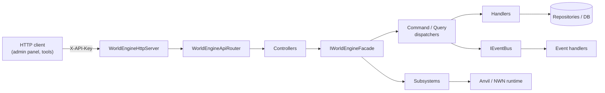

# WorldEngine Documentation

WorldEngine is the persistent-world simulation framework that powers the Amia Reforged server. It unifies economy, organizations, industries, harvesting, regions, traits, items, codex (lore), dialogue, and interactions behind a single façade and exposes a REST API for external tooling (admin panel, world simulator, automation).

This folder contains the developer guide and the HTTP API reference. Source of truth for behaviour is always the code in [../](../); these docs explain how the pieces fit together and how to extend them.

## Quick links

### Developer guide

| Doc | What it covers |
| --- | --- |
| [architecture.md](architecture.md) | Layered architecture, façade, SharedKernel, bootstrap & DI. |
| [subsystems.md](subsystems.md) | Catalogue of all 11 subsystems + the `IPersonaGateway`. |
| [cqrs.md](cqrs.md) | Command/Query/Event pipeline, dispatchers, worked example. |
| [sanitization.md](sanitization.md) | Local-variable sanitization plugin pattern. |

### HTTP API

| Doc | What it covers |
| --- | --- |
| [api-reference.md](api-reference.md) | HTTP server, routing, controller index, sample calls. |

### How-to examples

| Example | Scenario |
| --- | --- |
| [examples/calling-the-api.md](examples/calling-the-api.md) | curl / PowerShell / `HttpClient` samples. |
| [examples/using-the-facade.md](examples/using-the-facade.md) | Inject `IWorldEngineFacade` in an Anvil service. |
| [examples/adding-a-controller.md](examples/adding-a-controller.md) | New controller with `[HttpGet]` / `[HttpPost]` routes. |
| [examples/adding-a-command.md](examples/adding-a-command.md) | New `ICommand` + handler. |
| [examples/adding-a-query.md](examples/adding-a-query.md) | New `IQuery<T>` + handler. |
| [examples/subscribing-to-events.md](examples/subscribing-to-events.md) | Implement `IEventHandler<T>`. |
| [examples/adding-a-subsystem.md](examples/adding-a-subsystem.md) | New subsystem wired into the façade. |

### Diagram sources

Standalone Mermaid sources live in [diagrams/](diagrams/) and are embedded inline in the guide documents above.

## At a glance

## Orientation

- **Facade**: [IWorldEngineFacade](../IWorldEngineFacade.cs) / [WorldEngineFacade](../WorldEngineFacade.cs) — single injectable entry point for everything else.
- **HTTP API**: [API/](../API/) — `HttpListener`-based server, attribute routing, 19 controllers.
- **CQRS plumbing**: [SharedKernel/Commands/](../SharedKernel/Commands/), [SharedKernel/Queries/](../SharedKernel/Queries/), [SharedKernel/Events/](../SharedKernel/Events/).
- **Subsystems**: [Subsystems/](../Subsystems/) — each one is a cohesive domain with its own repository/services.
- **Application handlers**: [Application/](../Application/) — command & query handlers grouped by domain.
- **Personas gateway**: [Core/Personas/](../Core/Personas/) — cross-cutting actor identity.
- **Sanitization**: [Sanitization/](../Sanitization/) — legacy local-variable migration on client enter.
- **Event bus**: [Services/AnvilEventBusService.cs](../Services/AnvilEventBusService.cs).

## Conventions

- DI is Anvil's `[ServiceBinding(typeof(TInterface))]`; constructors receive everything.
- Commands, queries, and events use records (`public record …`).
- Handlers are discovered by marker interfaces (`ICommandHandlerMarker`, `IQueryHandlerMarker`, `IEventHandlerMarker`).
- Strongly-typed IDs (`CharacterId`, `OrganizationId`, `IndustryTag`, …) live in [SharedKernel/](../SharedKernel/).
- Route handlers return [`ApiResult`](../API/IApiRouter.cs).
