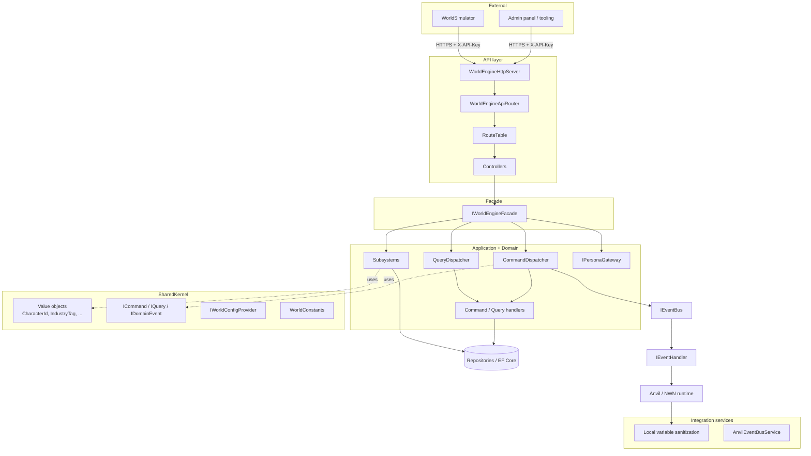

# Architecture

WorldEngine is organised as a set of cohesive layers that sit between Anvil (the NWN:EE server framework) and external clients. The goals are:

- **One entry point**: services consume [`IWorldEngineFacade`](../IWorldEngineFacade.cs) instead of a dozen individual subsystems.
- **CQRS**: commands mutate, queries read, events announce. All three route through a small, reflection-based dispatcher layer.
- **Plugin-friendly**: new subsystems, controllers, commands, queries and event handlers are added by dropping a class in place and tagging it with `[ServiceBinding]` or a marker interface.
- **Testable**: the HTTP layer, CQRS plumbing, and subsystems all have test projects under `../Tests/` siblings.

## Layer diagram

The source for this diagram is in [diagrams/component.mmd](diagrams/component.mmd).

## Layer responsibilities

### API layer — [API/](../API/)

- [`WorldEngineHttpServer`](../API/WorldEngineHttpServer.cs) — `HttpListener` on `http://+:{port}/api/`. Validates the `X-API-Key` header, logs correlation IDs, serialises responses as camelCase JSON.
- [`WorldEngineApiRouter`](../API/WorldEngineApiRouter.cs) + [`RouteTable`](../API/RouteTable.cs) — scan the current assembly at startup and compile every method decorated with [`HttpRouteAttribute`](../API/HttpRouteAttribute.cs) (`[HttpGet]`, `[HttpPost]`, `[HttpPut]`, `[HttpPatch]`, `[HttpDelete]`) into a regex match list. More specific patterns (fewer `{params}`, longer literal text) are tried first.
- [`RouteContext`](../API/RouteContext.cs) — request, route values, query params, `ReadJsonBodyAsync<T>()`, and an `IServiceProvider`.
- Controllers live in [API/Controllers/](../API/Controllers/). Route methods are `static Task<ApiResult>` whenever possible; when they need state, the router uses `Activator.CreateInstance(type)` so controllers should stay parameterless — resolve services through `ctx.Services` instead.
- Bootstrap: [`WorldEngineHttpApiBootstrap`](../API/WorldEngineHttpApiBootstrap.cs) is a `[ServiceBinding]` that runs at module load, reads env vars, constructs the router, and starts the listener.

### Facade layer — [../](../)

[`IWorldEngineFacade`](../IWorldEngineFacade.cs) exposes:

- `IPersonaGateway Personas` — cross-cutting actor identity.
- Eleven subsystem properties (`Economy`, `Organizations`, `Characters`, `Industries`, `Harvesting`, `Regions`, `Traits`, `Items`, `Codex`, `Interactions`, `Dialogue`).
- `ExecuteAsync<TCommand>(…)`, `ExecuteBatchAsync<TCommand>(…)`, `QueryAsync<TQuery, TResult>(…)` — central CQRS dispatch.

The implementation ([`WorldEngineFacade`](../WorldEngineFacade.cs)) is a thin aggregator bound with `[ServiceBinding(typeof(IWorldEngineFacade))]`; all collaborators are constructor-injected.

### Subsystems — [Subsystems/](../Subsystems/)

Each subsystem is a cohesive domain boundary: interface in `Subsystems/I*Subsystem.cs` (or inside its folder), concrete implementation in `Subsystems/Implementations/` or the subsystem folder, plus repositories, domain types, and (often) a bootstrap service that loads persistent data at module start. See [subsystems.md](subsystems.md).

### Application layer — [Application/](../Application/)

CQRS handlers grouped by domain. Each domain folder has `Commands/`, `Queries/`, and `Handlers/`. Simple commands/queries keep their handler in the same file as the record; more complex ones get their own file under `Handlers/`. See [cqrs.md](cqrs.md).

### SharedKernel — [SharedKernel/](../SharedKernel/)

Cross-cutting primitives:

- **Commands** (`ICommand`, `ICommandHandler<T>`, `ICommandDispatcher`, `CommandResult`, `BatchCommandResult`, `BatchExecutionOptions`).
- **Queries** (`IQuery<TResult>`, `IQueryHandler<TQuery, TResult>`, `IQueryDispatcher`).
- **Events** (`IDomainEvent`, `IEventBus`, `IEventHandler<T>`, marker interfaces, `CommandExecutedEvent<T>`).
- **Value objects / IDs**: `CharacterId`, `DmId`, `OrganizationId`, `GovernmentId`, `IndustryTag`, `TraitTag`, `WorkstationTag`, plus everything under [SharedKernel/ValueObjects/](../SharedKernel/ValueObjects/).
- **Configuration**: [`IWorldConfigProvider`](../SharedKernel/IWorldConfigProvider.cs) / [`WorldEngineConfig`](../SharedKernel/WorldEngineConfig.cs).
- **Constants**: [`WorldConstants`](../SharedKernel/WorldConstants.cs).
- **Helpers**: [`DeterministicGuidFactory`](../SharedKernel/DeterministicGuidFactory.cs) for stable GUIDs derived from tags.

### Sanitization — [Sanitization/](../Sanitization/)

Plugin-style service that repairs legacy local variables on player-controlled creatures when the client enters. See [sanitization.md](sanitization.md).

### Services — [Services/](../Services/)

- [`AnvilEventBusService`](../Services/AnvilEventBusService.cs) — bound as `IEventBus`. Discovers every `IEventHandler<T>` via the `IEventHandlerMarker` interface, queues published events, and processes them asynchronously.

### Core / Personas — [Core/Personas/](../Core/Personas/)

[`IPersonaGateway`](../Core/Personas/IPersonaGateway.cs) exposes a unified abstraction over anything that can act in the world (players, characters, organisations, governments, NPCs). Used pervasively to avoid special-casing actor types. See [Core/Personas/README.md](../Core/Personas/README.md) for the model details.

## Bootstrap & dependency injection

WorldEngine runs inside Anvil's DI container. A service is registered by attaching `[ServiceBinding(typeof(TInterface))]` to the class — Anvil constructs it on module load and injects collaborators via the constructor.

Bootstrap services (services whose *only* purpose is to run startup code) follow the pattern of binding `[ServiceBinding(typeof(TheBootstrapClass))]` and doing the work in their constructor (and optionally `IDisposable.Dispose` for teardown):

| Bootstrap | Purpose |
| --- | --- |
| [`WorldEngineHttpApiBootstrap`](../API/WorldEngineHttpApiBootstrap.cs) | Reads env vars, starts `WorldEngineHttpServer`. |
| [`EconomyBootstrapService`](../Subsystems/Economy/EconomyBootstrapService.cs) | Loads persistent economy data (coinhouses, shops, nodes). |
| [`TraitBootstrapService`](../Subsystems/Traits/TraitBootstrapService.cs) | Loads trait definitions. |
| [`WorkstationBootstrapService`](../Subsystems/Industries/WorkstationBootstrapService.cs) | Spawns crafting workstations. |

## Configuration

Runtime configuration comes from two places:

1. **Environment variables**, for infrastructure concerns:
   - `WORLDENGINE_API_PORT` — HTTP listener port (default `8080`).
   - `WORLDENGINE_API_KEY` — value that every request must send in the `X-API-Key` header.
2. **Database**, for game-tuning knobs, via [`IWorldConfigProvider`](../SharedKernel/IWorldConfigProvider.cs) — `GetBoolean` / `GetInt` / `GetFloat` / `GetString` with matching setters.

Known config keys and domain constants (resource-node spacing, local-variable keys, knowledge progression costs, etc.) live in [`WorldConstants`](../SharedKernel/WorldConstants.cs).

## Testing

- `API/Tests/` — routing, HTTP integration, end-to-end.
- `SharedKernel/Tests/` — command/query dispatch, event bus.
- `Subsystems/**/Tests/` — per-subsystem unit and integration tests.
- Framework: NUnit. Bigger integration suites run with the usual `dotnet test`.

## Where to go next

- Extending behaviour? Start with [examples/](examples/).
- Adding an HTTP endpoint? [api-reference.md](api-reference.md) + [examples/adding-a-controller.md](examples/adding-a-controller.md).
- Understanding a subsystem? [subsystems.md](subsystems.md).
- Writing a command or query? [cqrs.md](cqrs.md).
