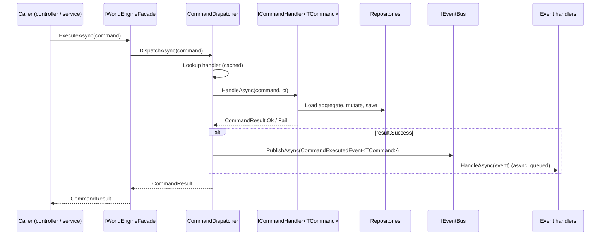
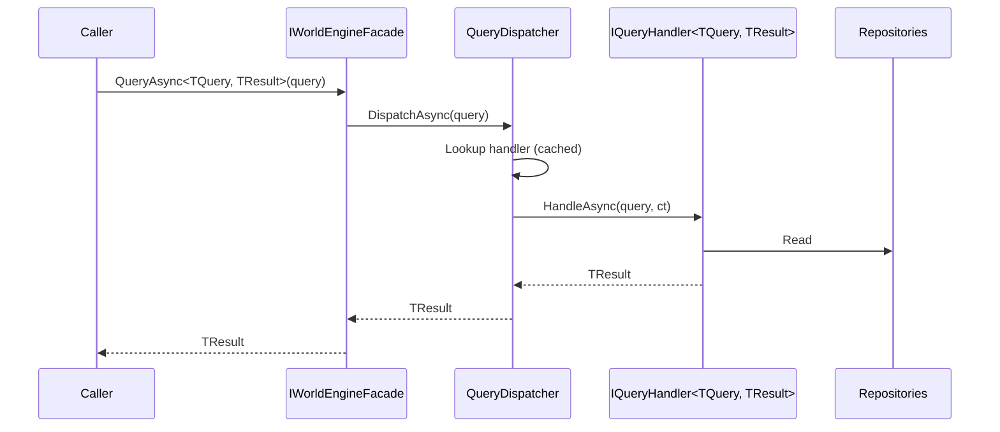

# CQRS: commands, queries, and events

WorldEngine separates state-changing operations (commands) from reads (queries) and announcements (events). All three route through small dispatchers that are discovered at startup via marker interfaces.

## Pieces at a glance

| Piece | Interface | Purpose |
| --- | --- | --- |
| Command | [`ICommand`](../SharedKernel/Commands/ICommand.cs) | Marker record that represents a write. |
| Command handler | [`ICommandHandler<TCommand>`](../SharedKernel/Commands/ICommandHandler.cs) | Executes the command and returns [`CommandResult`](../SharedKernel/Commands/CommandResult.cs). |
| Command dispatcher | [`ICommandDispatcher`](../SharedKernel/Commands/ICommandDispatcher.cs) → [`CommandDispatcher`](../SharedKernel/Commands/CommandDispatcher.cs) | Caches handlers, invokes by type, publishes `CommandExecutedEvent` on success. |
| Query | [`IQuery<TResult>`](../SharedKernel/Queries/IQuery.cs) | Marker record for a read. |
| Query handler | [`IQueryHandler<TQuery, TResult>`](../SharedKernel/Queries/IQueryHandler.cs) | Reads and returns `TResult`. |
| Query dispatcher | [`IQueryDispatcher`](../SharedKernel/Queries/IQueryDispatcher.cs) → [`QueryDispatcher`](../SharedKernel/Queries/QueryDispatcher.cs) | Looks up and invokes query handlers. |
| Domain event | [`IDomainEvent`](../SharedKernel/Events/IDomainEvent.cs) | Past-tense fact; carries `EventId`/`OccurredAt`. |
| Event handler | [`IEventHandler<TEvent>`](../SharedKernel/Events/IEventHandler.cs) | Reacts to an event. |
| Event bus | [`IEventBus`](../SharedKernel/Events/IEventBus.cs) → [`AnvilEventBusService`](../Services/AnvilEventBusService.cs) | Queues events and fans out to handlers in a background loop. |

Discovery happens through the three marker interfaces:
[`ICommandHandlerMarker`](../SharedKernel/Commands/ICommandHandlerMarker.cs),
[`IQueryHandlerMarker`](../SharedKernel/Queries/IQueryHandlerMarker.cs), and
[`IEventHandlerMarker`](../SharedKernel/Events/IEventHandlerMarker.cs).
Any class that implements `ICommandHandler<T>` / `IQueryHandler<T, R>` / `IEventHandler<T>` inherits the matching marker and is injected as an enumerable into the dispatcher/bus at construction time.

## Command pipeline



Source: [diagrams/cqrs-sequence.mmd](diagrams/cqrs-sequence.mmd).

Notes:

- `CommandDispatcher` catches exceptions and converts them into `CommandResult.Fail(...)`; callers can rely on a non-throwing contract.
- On `Success`, the dispatcher automatically publishes [`CommandExecutedEvent<TCommand>`](../SharedKernel/Events/CommandExecutedEvent.cs). Subscribe to it to trigger side effects.
- Batch execution is available via `ExecuteBatchAsync` / `DispatchBatchAsync` with [`BatchExecutionOptions`](../SharedKernel/Commands/BatchExecutionOptions.cs) (e.g. `StopOnFirstFailure`).

## Query pipeline



Source: [diagrams/query-sequence.mmd](diagrams/query-sequence.mmd).

Queries don't publish events.

## `CommandResult` cheat sheet

```csharp
// Success
return Task.FromResult(CommandResult.Ok());
return Task.FromResult(CommandResult.OkWith("recipeId", recipe.RecipeId.Value));

// Failure
return Task.FromResult(CommandResult.Fail("Industry 'smithing' not found"));
```

Shape:

```csharp
public sealed record CommandResult
{
    public bool Success { get; init; }
    public string? ErrorMessage { get; init; }
    public Dictionary<string, object>? Data { get; init; }
}
```

## Worked example — Industries

### Command + handler (co-located)

From [Application/Industries/Commands/AddRecipeToIndustryCommand.cs](../Application/Industries/Commands/AddRecipeToIndustryCommand.cs):

```csharp
public record AddRecipeToIndustryCommand : ICommand
{
    public required IndustryTag IndustryTag { get; init; }
    public required Recipe Recipe { get; init; }
}

[ServiceBinding(typeof(ICommandHandler<AddRecipeToIndustryCommand>))]
public class AddRecipeToIndustryHandler : ICommandHandler<AddRecipeToIndustryCommand>
{
    private readonly IIndustryRepository _industryRepository;

    public AddRecipeToIndustryHandler(IIndustryRepository industryRepository)
        => _industryRepository = industryRepository;

    public Task<CommandResult> HandleAsync(
        AddRecipeToIndustryCommand command,
        CancellationToken cancellationToken = default)
    {
        Industry? industry = _industryRepository.GetByTag(command.IndustryTag);
        if (industry == null)
            return Task.FromResult(CommandResult.Fail(
                $"Industry '{command.IndustryTag.Value}' not found"));

        if (industry.Recipes.Any(r => r.RecipeId == command.Recipe.RecipeId))
            return Task.FromResult(CommandResult.Fail(
                $"Recipe '{command.Recipe.RecipeId.Value}' already exists in industry '{command.IndustryTag.Value}'"));

        if (command.Recipe.IndustryTag != command.IndustryTag)
            return Task.FromResult(CommandResult.Fail(
                $"Recipe industry tag '{command.Recipe.IndustryTag.Value}' does not match target industry '{command.IndustryTag.Value}'"));

        industry.Recipes.Add(command.Recipe);
        return Task.FromResult(CommandResult.Ok());
    }
}
```

Dispatch from any service or controller:

```csharp
var result = await worldEngine.ExecuteAsync(new AddRecipeToIndustryCommand
{
    IndustryTag = new IndustryTag("smithing"),
    Recipe      = recipe
});

if (!result.Success) { /* result.ErrorMessage */ }
```

### Query + handler

From [Application/Industries/Queries/GetAvailableRecipesQuery.cs](../Application/Industries/Queries/GetAvailableRecipesQuery.cs):

```csharp
public record GetAvailableRecipesQuery : IQuery<List<Recipe>>
{
    public required CharacterId CharacterId { get; init; }
    public required IndustryTag IndustryTag { get; init; }
}

[ServiceBinding(typeof(IQueryHandler<GetAvailableRecipesQuery, List<Recipe>>))]
public class GetAvailableRecipesHandler
    : IQueryHandler<GetAvailableRecipesQuery, List<Recipe>>
{
    // ...constructor takes repositories...

    public Task<List<Recipe>> HandleAsync(
        GetAvailableRecipesQuery query,
        CancellationToken cancellationToken = default)
    {
        Industry? industry = _industryRepository.GetByTag(query.IndustryTag);
        if (industry == null) return Task.FromResult(new List<Recipe>());

        var memberships = _membershipRepository.All(query.CharacterId.Value);
        var membership = memberships
            .FirstOrDefault(m => m.IndustryTag.Value == query.IndustryTag.Value);
        if (membership == null) return Task.FromResult(new List<Recipe>());

        var known = _knowledgeRepository
            .GetAllKnowledge(query.CharacterId.Value)
            .Select(k => k.Tag)
            .ToHashSet();

        return Task.FromResult(
            industry.Recipes
                .Where(r => r.RequiredKnowledge.All(k => known.Contains(k)))
                .ToList());
    }
}
```

Dispatch:

```csharp
List<Recipe> available = await worldEngine
    .QueryAsync<GetAvailableRecipesQuery, List<Recipe>>(new GetAvailableRecipesQuery
    {
        CharacterId = characterId,
        IndustryTag = new IndustryTag("smithing")
    });
```

## When to pick which tool

- **Command** — the operation mutates state or might fail in a domain-meaningful way.
- **Query** — pure read; returns data, no persistence side-effects.
- **Event** — something already happened; you want other parts of the system to react without coupling. Prefer publishing a domain-specific event over invoking another subsystem directly.

## Extending

- New command: [examples/adding-a-command.md](examples/adding-a-command.md).
- New query: [examples/adding-a-query.md](examples/adding-a-query.md).
- Subscribing to events: [examples/subscribing-to-events.md](examples/subscribing-to-events.md).
