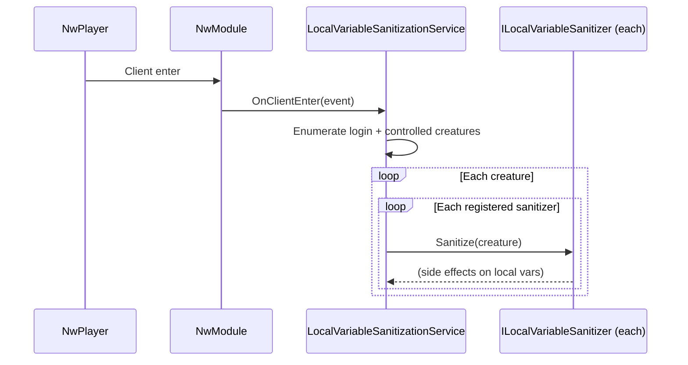

# Local variable sanitization

The engine persists per-creature state as NWN local variables. Over the years the keys have changed (renames, prefix migrations, dropped flags). The sanitization layer repairs legacy state on a player-controlled creature whenever that player logs in, so the rest of the engine only ever sees canonical keys.

Source: [Sanitization/](../Sanitization/).

## Moving parts

| Type | Role |
| --- | --- |
| [`ILocalVariableSanitizer`](../Sanitization/ILocalVariableSanitizer.cs) | Plugin interface: `Name` + `Sanitize(NwCreature)`. |
| [`ILocalVariableSanitizationService`](../Sanitization/ILocalVariableSanitizationService.cs) | Service that owns the sanitizer list and runs them at the right time. |
| [`LocalVariableSanitizationService`](../Sanitization/LocalVariableSanitizationService.cs) | `[ServiceBinding]`ed implementation. Subscribes to `NwModule.Instance.OnClientEnter`. |
| [`LocalVariableKeyUtility`](../Sanitization/LocalVariableKeyUtility.cs) | Helpers for building canonical keys (hashing, length limits, etc.). |
| [`NpcShopWindowFlagSanitizer`](../Sanitization/NpcShopWindowFlagSanitizer.cs) | Concrete sanitizer: migrates legacy `engine_npc_shop_window_<tag>` flags. |

## How it runs



- Only non-DM, valid players are processed.
- Both `LoginCreature` and `ControlledCreature` (if different) are sanitised.
- Sanitizer exceptions are caught and logged — one broken sanitizer cannot stop the others.
- The service is `IDisposable` and unsubscribes from `OnClientEnter` on shutdown.

## Registering a sanitizer

Sanitizers register **themselves** in their constructor:

```csharp
[ServiceBinding(typeof(MySanitizer))]
public sealed class MySanitizer : ILocalVariableSanitizer
{
    public MySanitizer(ILocalVariableSanitizationService sanitizationService)
    {
        sanitizationService.RegisterSanitizer(this);
    }

    public string Name => "My sanitizer";

    public void Sanitize(NwCreature creature)
    {
        // idempotent migration / repair logic
    }
}
```

Anvil instantiates `MySanitizer`; the constructor calls `RegisterSanitizer(this)`. No other wiring needed.

## Guidelines for sanitizers

- **Idempotent.** A sanitizer runs on every login. Running it twice must produce the same result.
- **Fast.** Work happens on the main thread during client enter; keep it to localvar reads/writes and cheap checks.
- **Scoped.** Own exactly one concern per sanitizer — e.g. one key prefix, one legacy flag, one data format. Compose multiple sanitizers instead of writing one mega-class.
- **Log at `Debug`/`Warn`.** The service already catches exceptions and logs them.

## Worked example — `NpcShopWindowFlagSanitizer`

```csharp
[ServiceBinding(typeof(NpcShopWindowFlagSanitizer))]
public sealed class NpcShopWindowFlagSanitizer : ILocalVariableSanitizer
{
    private const string ShopWindowFlagPrefix = "engine_npc_shop_window_";

    private readonly INpcShopRepository _shops;

    public NpcShopWindowFlagSanitizer(
        ILocalVariableSanitizationService sanitizationService,
        INpcShopRepository shops)
    {
        _shops = shops;
        sanitizationService.RegisterSanitizer(this);
    }

    public string Name => "NPC shop window flags";

    public void Sanitize(NwCreature creature)
    {
        if (creature is not { IsValid: true }) return;

        foreach (NpcShop shop in _shops.All())
        {
            if (string.IsNullOrWhiteSpace(shop.Tag)) continue;

            string legacyKey    = ShopWindowFlagPrefix + shop.Tag;
            string sanitizedKey = LocalVariableKeyUtility.BuildKey(
                ShopWindowFlagPrefix, shop.Tag);

            if (legacyKey == sanitizedKey) continue; // no migration needed

            LocalVariableInt legacy = creature.GetObjectVariable<LocalVariableInt>(legacyKey);
            if (!legacy.HasValue) continue;

            creature.GetObjectVariable<LocalVariableInt>(sanitizedKey).Value = legacy.Value;
            legacy.Delete();
        }
    }
}
```

The sanitizer:

1. Iterates every known NPC shop.
2. Computes the legacy key and the canonical key via `LocalVariableKeyUtility.BuildKey` (which applies length / hashing rules).
3. If the keys differ and a legacy value is present, copies it to the canonical key and deletes the legacy one.

## Testing

`LocalVariableSanitizationService.Sanitize(NwCreature creature)` is also exposed publicly — integration tests or admin tools can invoke it directly on a specific creature without waiting for login.
