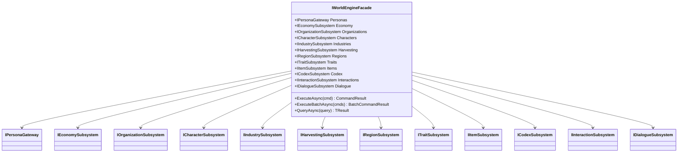
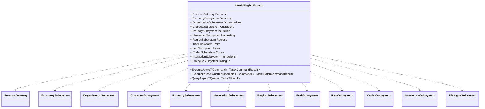

# Subsystems

Every subsystem behind the façade is a cohesive domain with its own interface, implementation, repositories, and (frequently) a bootstrap service. The façade ([`IWorldEngineFacade`](../IWorldEngineFacade.cs)) exposes them as properties so you can reach any of them from anywhere in the engine with a single injected dependency.



Source: [diagrams/subsystems-class.mmd](diagrams/subsystems-class.mmd).

## Catalogue

| Subsystem | Interface | Folder | Responsibility |
| --- | --- | --- | --- |
| Economy | [`IEconomySubsystem`](../Subsystems/Economy/IEconomySubsystem.cs) | [Subsystems/Economy/](../Subsystems/Economy/) | Banking, storage, shops (NPC and player stalls). Exposes `Banking`, `Storage`, `Shops` facades. |
| Organizations | [`IOrganizationSubsystem`](../Subsystems/IOrganizationSubsystem.cs) | [Subsystems/Organizations/](../Subsystems/Organizations/) | Guilds/factions, membership, ranks, diplomatic stance. |
| Characters | [`ICharacterSubsystem`](../Subsystems/ICharacterSubsystem.cs) | [Subsystems/Characters/](../Subsystems/Characters/) | Persistent character registration, stats, reputation. |
| Industries | [`IIndustrySubsystem`](../Subsystems/IIndustrySubsystem.cs) | [Subsystems/Industries/](../Subsystems/Industries/) | Crafting recipes, workstations, knowledge progression. |
| Harvesting | [`IHarvestingSubsystem`](../Subsystems/IHarvestingSubsystem.cs) | [Subsystems/Harvesting/](../Subsystems/Harvesting/) | Resource gathering interactions. |
| Regions | [`IRegionSubsystem`](../Subsystems/IRegionSubsystem.cs) | [Subsystems/Regions/](../Subsystems/Regions/) | Regional groupings of areas & regional effects. |
| Traits | [`ITraitSubsystem`](../Subsystems/ITraitSubsystem.cs) | [Subsystems/Traits/](../Subsystems/Traits/) | Character traits and their effects. |
| Items | [`IItemSubsystem`](../Subsystems/IItemSubsystem.cs) | [Subsystems/Items/](../Subsystems/Items/) | Item definitions, blueprints, properties. |
| Codex | [`ICodexSubsystem`](../Subsystems/ICodexSubsystem.cs) | [Subsystems/Codex/](../Subsystems/Codex/) | In-world knowledge / lore entries. |
| Interactions | [`IInteractionSubsystem`](../Subsystems/IInteractionSubsystem.cs) | [Subsystems/Interactions/](../Subsystems/Interactions/) | Generic interaction framework (harvesting, prospecting, etc.). |
| Dialogue | [`IDialogueSubsystem`](../Subsystems/IDialogueSubsystem.cs) | [Subsystems/Dialogue/](../Subsystems/Dialogue/) | NPC dialogue trees, runtime conversations. |

Concrete implementations live under [Subsystems/Implementations/](../Subsystems/Implementations/) or alongside each subsystem folder. Each is registered with `[ServiceBinding(typeof(I*Subsystem))]`.

### Supporting folders under `Subsystems/`

These folders contain domain types, repositories, and services that the subsystems consume:

- [AreaGraph/](../Subsystems/AreaGraph/) — area connectivity graph used by region queries and pathing.
- [AreaPersistence/](../Subsystems/AreaPersistence/) — persistent area data (reload, backup integration).
- [ResourceNodes/](../Subsystems/ResourceNodes/) — harvestable resource nodes; spawned from persistent definitions at module load.
- [Time/](../Subsystems/Time/) — in-game time/calendar.

## The Personas gateway

Personas are the cross-cutting actor identity. Instead of asking "is this a character, a DM, an organisation, a government, or an NPC?" at every call site, the engine wraps them all in a [`PersonaId`](../SharedKernel/Personas/) and a `PersonaInfo`. The gateway is [`IPersonaGateway`](../Core/Personas/IPersonaGateway.cs) — implemented by [`PersonaGateway`](../Core/Personas/PersonaGateway.cs) — with methods for:

- Single / batch lookup (`GetPersonaAsync`, `GetPersonasAsync`, `ExistsAsync`).
- Mapping between players and their characters (`GetPlayerCharactersAsync`, `GetCharacterOwnerAsync`).
- Aggregate retrieval that pulls a persona together with its relationships (`GetAggregatePersonaAsync`, `GetAggregatePersonaWithRelationsAsync`).

Read [Core/Personas/README.md](../Core/Personas/README.md) for the domain model.

## Conventions used by every subsystem

- **One interface per boundary.** The interface is what lives on `IWorldEngineFacade`.
- **Repositories, not DbContexts.** Subsystems talk to persistence through repository interfaces; the EF-Core side is wired via Anvil DI.
- **Bootstrap services** seed or hydrate runtime state from persistence (e.g. [`EconomyBootstrapService`](../Subsystems/Economy/EconomyBootstrapService.cs), [`TraitBootstrapService`](../Subsystems/Traits/TraitBootstrapService.cs), [`WorkstationBootstrapService`](../Subsystems/Industries/WorkstationBootstrapService.cs)).
- **Subsystems don't know about each other.** Cross-subsystem work is coordinated through the façade, through events, or through the Personas gateway.

## Extending

See [examples/adding-a-subsystem.md](examples/adding-a-subsystem.md) for the step-by-step procedure.
# Subsystems

The façade exposes eleven subsystems plus one cross-cutting gateway. Each subsystem is a cohesive domain with its own interface, implementation, repositories, and (where applicable) bootstrap service.

Source: [`IWorldEngineFacade`](../IWorldEngineFacade.cs), [`WorldEngineFacade`](../WorldEngineFacade.cs), [Subsystems/](../Subsystems/).

## Façade shape



Source: [diagrams/subsystems-class.mmd](diagrams/subsystems-class.mmd).

## Subsystem catalogue

| Property | Interface | Responsibility |
| --- | --- | --- |
| `Personas` | [`IPersonaGateway`](../Core/Personas/IPersonaGateway.cs) | Cross-cutting actor identity — players, characters, organisations, governments, NPCs. See [Core/Personas/README.md](../Core/Personas/README.md). |
| `Economy` | [`IEconomySubsystem`](../Subsystems/Economy/IEconomySubsystem.cs) | Umbrella over banking, storage, and shops via sub-façades. |
| `Organizations` | [`IOrganizationSubsystem`](../Subsystems/IOrganizationSubsystem.cs) | Organisations, membership, diplomacy. |
| `Characters` | [`ICharacterSubsystem`](../Subsystems/ICharacterSubsystem.cs) | Character registration, stats, reputation. |
| `Industries` | [`IIndustrySubsystem`](../Subsystems/IIndustrySubsystem.cs) | Crafting industries, recipes, workstations, knowledge progression. |
| `Harvesting` | [`IHarvestingSubsystem`](../Subsystems/IHarvestingSubsystem.cs) | Resource gathering against resource nodes. |
| `Regions` | [`IRegionSubsystem`](../Subsystems/IRegionSubsystem.cs) | Regions / area grouping / regional effects. |
| `Traits` | [`ITraitSubsystem`](../Subsystems/ITraitSubsystem.cs) | Character traits and trait effects. |
| `Items` | [`IItemSubsystem`](../Subsystems/IItemSubsystem.cs) | Item definitions, blueprints, and property lookups. |
| `Codex` | [`ICodexSubsystem`](../Subsystems/ICodexSubsystem.cs) | Knowledge / lore catalogue. |
| `Interactions` | [`IInteractionSubsystem`](../Subsystems/IInteractionSubsystem.cs) | Generic interaction framework (harvesting, prospecting, …). |
| `Dialogue` | [`IDialogueSubsystem`](../Subsystems/IDialogueSubsystem.cs) | NPC dialogue trees and runtime conversations. |

Concrete implementations for most of the above live in [Subsystems/Implementations/](../Subsystems/Implementations/); larger subsystems (Economy, Industries, Harvesting, Regions, Traits) keep their implementation beside their domain code in their own folder.

## Folder map

```text
Subsystems/
├── AreaGraph/            # Area connectivity graph
├── AreaPersistence/      # Persistent area state
├── Characters/           # Character entities, repositories
├── Codex/                # Lore entries
├── Dialogue/             # Dialogue trees
├── Economy/              # Banking, Storage, Shops + facades
├── Harvesting/           # Resource gathering
├── Industries/           # Crafting, recipes, knowledge, workstations
├── Interactions/         # Interaction framework
├── Items/                # Item definitions
├── Organizations/        # Guilds / factions
├── Regions/              # Regional boundaries
├── ResourceNodes/        # Harvestable nodes
├── Time/                 # In-game time
├── Traits/               # Character traits
└── Implementations/      # Concrete *Subsystem classes
```

## Cross-subsystem interaction rules

- Subsystems never depend on each other directly. When they need data from a sibling, they go through the façade or dispatch a query.
- Value objects from [SharedKernel/](../SharedKernel/) are the currency between subsystems — pass a `CharacterId`, not an `NwCreature`.
- The `IEventBus` is the preferred decoupling channel for reactions that span domains (e.g. "a recipe was learned → award XP"). See [cqrs.md](cqrs.md) and [examples/subscribing-to-events.md](examples/subscribing-to-events.md).

## Economy — a sub-façade

[`IEconomySubsystem`](../Subsystems/Economy/IEconomySubsystem.cs) is itself a mini-façade exposing `Banking`, `Storage`, and `Shops` via [facades under `Subsystems/Economy/Facades/`](../Subsystems/Economy/Facades/). This lets a controller inject just `facade.Economy.Shops` and leave banking logic untouched.

## Adding a new subsystem

See [examples/adding-a-subsystem.md](examples/adding-a-subsystem.md) for the full recipe.
