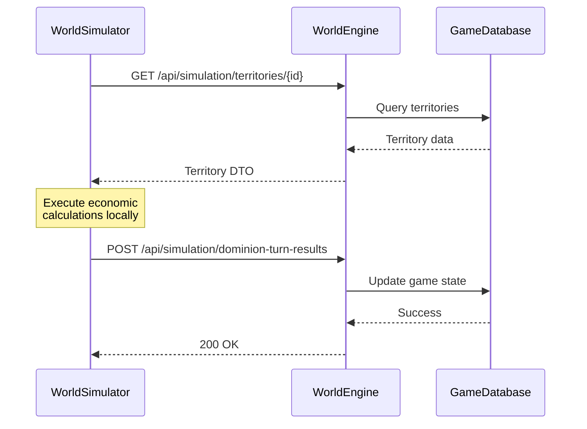
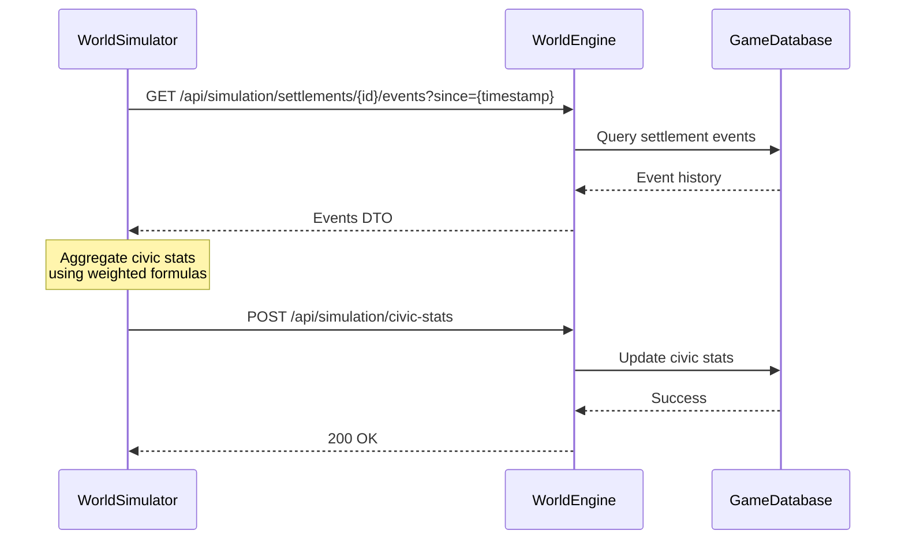

# WorldSimulator Communication Architecture

**Date**: October 29, 2025
**Status**: Design - Implementation Pending

## Overview

WorldSimulator is a completely independent service that communicates with the WorldEngine (NWN game server) over the network (VLAN/Docker network). **No shared database access** - all communication happens via HTTP/gRPC.

## Network Architecture

```
┌─────────────────────────────┐         ┌─────────────────────────────┐
│   WorldSimulator Service    │         │  WorldEngine (Game Server)  │
│   (Standalone Container)    │◄───────►│   (NWN Server Container)    │
├─────────────────────────────┤  HTTP/  ├─────────────────────────────┤
│ - PostgreSQL (simulation)   │  gRPC   │ - PostgreSQL (gameserver)   │
│ - Port: 8081                │         │ - Port: 8080                │
│ - Separate database instance│         │ - Separate database instance│
└─────────────────────────────┘         └─────────────────────────────┘
         │                                        │
         │                                        │
         └────────────── VLAN ───────────────────┘
```

## Communication Patterns

### 1. Health Checks (Circuit Breaker)

**Direction**: WorldSimulator → WorldEngine
**Protocol**: HTTP GET
**Endpoint**: `GET http://worldengine:8080/health`
**Frequency**: Every 30 seconds (configurable)
**Purpose**: Determine if WorldEngine is available before processing work

```csharp
// CircuitBreakerService.cs
HttpResponseMessage response = await _httpClient.GetAsync($"{host}/health");
if (response.IsSuccessStatusCode)
{
    // Circuit Closed - WorldEngine available, process work
}
else
{
    // Circuit Open - WorldEngine unavailable, pause work
}
```

### 2. Data Requests (Future)

**Direction**: WorldSimulator → WorldEngine
**Protocol**: HTTP GET or gRPC
**Purpose**: Request game world data for simulation calculations

#### Example: Get Territory Data

```http
GET http://worldengine:8080/api/simulation/territories/{governmentId}
Authorization: Bearer {service_token}
```

**Response**:
```json
{
  "governmentId": "uuid",
  "territories": [
    {
      "id": "uuid",
      "name": "North Territory",
      "regions": [...],
      "resourceProduction": {...}
    }
  ]
}
```

#### Example: Get Settlement Data

```http
GET http://worldengine:8080/api/simulation/settlements/{settlementId}
Authorization: Bearer {service_token}
```

**Response**:
```json
{
  "settlementId": "uuid",
  "name": "Cordor",
  "population": 5000,
  "currentCivicStats": {
    "loyalty": 75,
    "security": 60,
    "prosperity": 80
  },
  "recentEvents": [
    { "type": "Crime", "impact": -5, "timestamp": "2025-10-29T12:00:00Z" }
  ]
}
```

### 3. Result Submission (Future)

**Direction**: WorldSimulator → WorldEngine
**Protocol**: HTTP POST or gRPC
**Purpose**: Send simulation results back to game server

#### Example: Submit Dominion Turn Results

```http
POST http://worldengine:8080/api/simulation/dominion-turn-results
Authorization: Bearer {service_token}
Content-Type: application/json
```

**Request Body**:
```json
{
  "jobId": "uuid",
  "governmentId": "uuid",
  "turnDate": "2025-10-29T00:00:00Z",
  "results": {
    "territoryUpdates": [...],
    "civicStatUpdates": [...],
    "marketPriceAdjustments": [...],
    "personaActionOutcomes": [...]
  },
  "metadata": {
    "processingTimeMs": 1234,
    "scenariosProcessed": 15
  }
}
```

#### Example: Submit Civic Stats Update

```http
POST http://worldengine:8080/api/simulation/civic-stats
Authorization: Bearer {service_token}
Content-Type: application/json
```

**Request Body**:
```json
{
  "settlementId": "uuid",
  "civicStats": {
    "loyalty": 78,
    "security": 62,
    "prosperity": 82,
    "happiness": 75,
    "militaryMight": 50,
    "arcanePower": 30,
    "defense": 65,
    "manpower": 2500
  },
  "calculatedAt": "2025-10-29T12:34:56Z"
}
```

### 4. Event Notifications (Current)

**Direction**: WorldSimulator → Discord
**Protocol**: Discord Webhook (HTTP POST)
**Purpose**: Operational monitoring and alerting

```csharp
// DiscordEventLogService.cs
await _webhookClient.SendMessageAsync(
    text: $"**{severity}**: {eventType}",
    embeds: new[] { embed }
);
```

## Service Discovery

### Development
- WorldEngine: `http://localhost:8080`
- WorldSimulator: `http://localhost:8081`

### Docker Compose
```yaml
services:
  worldengine:
    image: worldengine:latest
    container_name: worldengine
    ports:
      - "8080:8080"
    networks:
      - amia-network

  worldsimulator:
    image: worldsimulator:latest
    container_name: worldsimulator
    environment:
      - WorldEngine__Host=http://worldengine:8080
    networks:
      - amia-network

networks:
  amia-network:
    driver: bridge
```

### Kubernetes
```yaml
apiVersion: v1
kind: Service
metadata:
  name: worldengine
spec:
  selector:
    app: worldengine
  ports:
    - port: 8080

---
apiVersion: apps/v1
kind: Deployment
metadata:
  name: worldsimulator
spec:
  template:
    spec:
      containers:
      - name: worldsimulator
        env:
        - name: WorldEngine__Host
          value: "http://worldengine:8080"
```

## Security

### Authentication
- **Service-to-Service**: Bearer token authentication
- **Token Management**: Shared secret or OAuth2 client credentials flow
- **Token Storage**: Environment variables or Kubernetes secrets

### Authorization
- WorldSimulator service account has read-only access to game data
- WorldSimulator can only POST to `/api/simulation/*` endpoints
- Rate limiting on API endpoints

### Network Security
- Internal VLAN/Docker network (not exposed to internet)
- TLS/HTTPS for production deployments
- Firewall rules limiting access to specific ports

## Data Flow Examples

### Dominion Turn Processing



### Civic Stats Aggregation



## Configuration

### WorldSimulator appsettings.json

```json
{
  "WorldEngine": {
    "Host": "http://worldengine:8080",
    "HealthEndpoint": "/health",
    "TimeoutSeconds": 30,
    "ApiKey": "${WORLDENGINE_API_KEY}"
  },
  "HttpClient": {
    "MaxRetries": 3,
    "RetryDelayMs": 1000,
    "CircuitBreakerThreshold": 5
  }
}
```

### Environment Variables

```bash
# WorldEngine connection
WorldEngine__Host=http://worldengine:8080
WorldEngine__ApiKey=your-secure-api-key-here

# Circuit breaker
CircuitBreaker__CheckIntervalSeconds=30
CircuitBreaker__TimeoutSeconds=5

# Resilience
HttpClient__MaxRetries=3
HttpClient__RetryDelayMs=1000
```

## Error Handling

### Connection Failures
1. Circuit breaker opens
2. Work processing pauses
3. Discord notification sent (if enabled)
4. Periodic health checks continue
5. Circuit closes when WorldEngine recovers
6. Work processing resumes

### API Errors
- **4xx Errors**: Log and fail the work item (data validation issue)
- **5xx Errors**: Retry with exponential backoff
- **Timeout**: Retry with backoff, eventually fail if persistent

### Resilience Patterns
- Circuit Breaker (Polly)
- Retry with exponential backoff (Polly)
- Timeout policies (Polly)
- Bulkhead isolation (future)

## Implementation Checklist

### Phase 1: HTTP Client Setup
- [ ] Create IWorldEngineClient interface
- [ ] Implement HttpWorldEngineClient with Polly policies
- [ ] Configure HttpClientFactory with typed client
- [ ] Add authentication/authorization
- [ ] Add integration tests with WireMock

### Phase 2: WorldEngine API Endpoints
- [ ] Health check endpoint (already exists)
- [ ] GET /api/simulation/territories/{id}
- [ ] GET /api/simulation/regions/{id}
- [ ] GET /api/simulation/settlements/{id}
- [ ] GET /api/simulation/settlements/{id}/events
- [ ] POST /api/simulation/dominion-turn-results
- [ ] POST /api/simulation/civic-stats
- [ ] POST /api/simulation/market-pricing
- [ ] POST /api/simulation/persona-action-results

### Phase 3: Data Transfer Objects (DTOs)
- [ ] TerritoryDto
- [ ] RegionDto
- [ ] SettlementDto
- [ ] EventHistoryDto
- [ ] DominionTurnResultDto
- [ ] CivicStatsDto
- [ ] MarketPricingDto
- [ ] PersonaActionResultDto

### Phase 4: Integration
- [ ] Update DominionTurnProcessor to use IWorldEngineClient
- [ ] Update SimulationWorker handlers to use IWorldEngineClient
- [ ] Add retry and timeout policies
- [ ] Integration tests with TestContainers
- [ ] Load testing for concurrent requests

## Monitoring

### Metrics to Track
- HTTP request duration (p50, p95, p99)
- HTTP error rate by endpoint
- Circuit breaker state changes
- Retry attempts
- Timeout occurrences
- Work item processing time

### Logging
```csharp
_logger.LogInformation(
    "Requesting territory data from WorldEngine: {GovernmentId}",
    governmentId);

_logger.LogWarning(
    "WorldEngine request failed, retrying: {Attempt}/{MaxRetries}",
    attempt, maxRetries);

_logger.LogError(ex,
    "Failed to submit dominion turn results after {Retries} retries",
    retries);
```

### Alerts
- Circuit breaker open for > 5 minutes
- HTTP error rate > 5%
- Request timeout rate > 10%
- Work item processing failures > threshold

## Testing Strategy

### Unit Tests
- Mock IWorldEngineClient
- Test business logic independently
- Verify correct DTOs are sent/received

### Integration Tests
- WireMock for WorldEngine API
- Verify HTTP request/response handling
- Test retry and circuit breaker behavior

### Contract Tests
- Pact or similar for API contract verification
- Ensure DTOs match between services
- Version compatibility checks

### End-to-End Tests
- Both services running in Docker
- Real HTTP communication
- Verify full workflow (request → process → submit)

## Migration Strategy

1. **Setup HTTP client infrastructure** (IWorldEngineClient, Polly policies)
2. **Create WorldEngine API endpoints** (start with health check, add others incrementally)
3. **Implement one workflow end-to-end** (e.g., civic stats)
4. **Add comprehensive tests** (unit, integration, contract)
5. **Deploy to staging** and monitor
6. **Gradual rollout** of remaining workflows
7. **Production deployment** with feature flags

## References

- `SimulatorRequirements.md` - Functional requirements
- `INDEPENDENCE_REFACTORING.md` - Architecture changes
- `README.md` - Setup and operational guide

